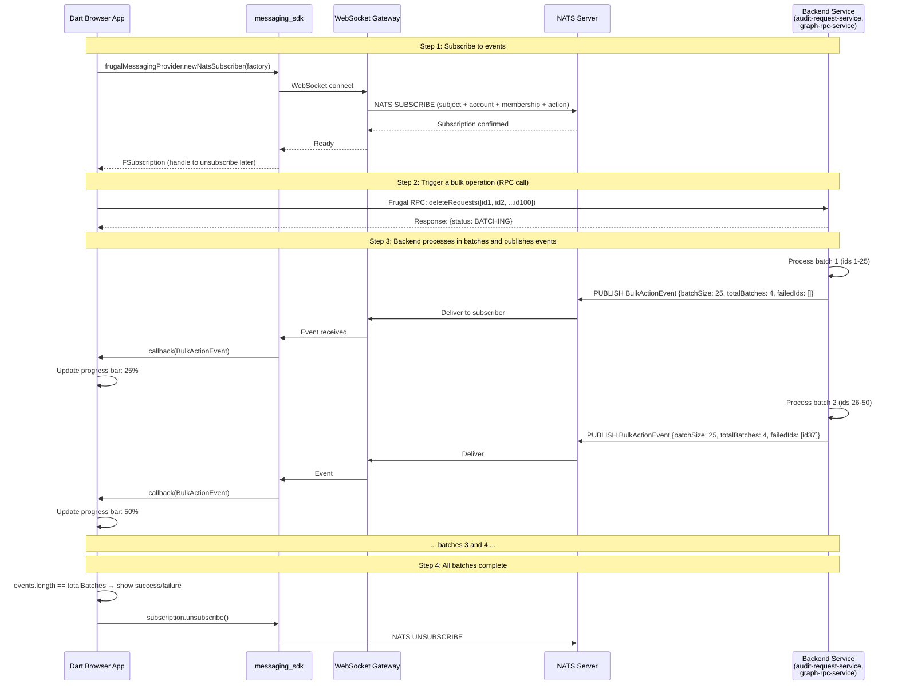

# Dart Pub/Sub to TypeScript — How It Works and How to Migrate

> **Date:** 2026-08-20
> **Purpose:** Detailed analysis of Dart's publish/subscribe (NATS) patterns across GRC repos and how to implement equivalent functionality in TypeScript

---

## Table of Contents

1. [How Pub/Sub Works in Dart Today](#1-how-pubsub-works-in-dart-today)
2. [The Full Pub/Sub Stack — Layer by Layer](#2-the-full-pubsub-stack--layer-by-layer)
3. [Concrete Pub/Sub Patterns Found in Each Repo](#3-concrete-pubsub-patterns-found-in-each-repo)
4. [How ts-grc Implements the Same Functionality in TypeScript](#4-how-ts-grc-implements-the-same-functionality-in-typescript)
5. [TypeScript Implementation Strategies](#5-typescript-implementation-strategies)
6. [Migration Decision Matrix — Per Use Case](#6-migration-decision-matrix--per-use-case)

---

## 1. How Pub/Sub Works in Dart Today

### What is Pub/Sub in This Context?

In the GRC Dart frontend, "pub/sub" refers to **NATS-based event subscriptions** where:

- The **browser** (Dart app) **subscribes** to a NATS subject
- The **backend service** **publishes** events to that subject as operations complete
- The browser receives events in real-time and updates the UI (e.g., progress bars, status changes)

This is NOT the same as:
- Redux pub/sub (internal state management — stays the same in TS)
- DOM events (browser-level — stays the same in TS)
- WebSocket generic messaging (NATS is a specific protocol)

### The Architecture



### Key Concepts

| Concept | What It Is | Dart Implementation |
|---|---|---|
| **NATS Subject** | A topic string that events are published/subscribed to | `'audit-request-service-v1'`, `'graphServiceSupport16'` |
| **FrugalMessagingProvider** | Abstraction layer that wraps NATS connections with Frugal protocol | `messaging_sdk` package |
| **NatsSubscriber** | A Frugal-generated subscriber that listens for specific event types | `frugalMessagingProvider.newNatsSubscriber(factory)` |
| **FSubscription** | Handle returned from subscribe — used to unsubscribe later | `_subscription = await subscriber.subscribeBulkActionResponse(...)` |
| **Event Factory** | Generated from Frugal IDL — deserializes NATS messages into typed Dart objects | `requestEventsSubscriberFactory`, `assessmentEventsSubscriberFactory` |
| **Callback** | Function called when an event arrives | `(_, event) => callback(BulkActionEvent.fromFrugal(event))` |
| **Thrift Protocol** | Serialization format for NATS messages | `ThriftProtocol.COMPACT` or `ThriftProtocol.DEFAULT` |

---

## 2. The Full Pub/Sub Stack — Layer by Layer

```
┌─────────────────────────────────────────────────┐
│  UI Component (OverReact)                        │
│  Shows progress bar, updates on each event       │
├─────────────────────────────────────────────────┤
│  Controller (BaseBulkActionController)           │
│  Manages subscription lifecycle, counts batches  │
│  Calls subscribe before RPC, unsubscribe after   │
├─────────────────────────────────────────────────┤
│  Service Layer (AuditRequestServices)            │
│  Creates NatsSubscriber from factory             │
│  Maps FSubscription to BulkAction enum           │
│  Translates Frugal events to domain models       │
├─────────────────────────────────────────────────┤
│  messaging_sdk (FrugalMessagingProvider)         │
│  Wraps NATS with Frugal protocol framing         │
│  Manages WebSocket connection lifecycle          │
│  Handles reconnection, timeouts, retries         │
├─────────────────────────────────────────────────┤
│  WebSocket Gateway                               │
│  Browser ↔ NATS bridge (server-side component)   │
│  Authenticates connections with session token     │
├─────────────────────────────────────────────────┤
│  NATS Server                                     │
│  Message broker — routes publishes to subscribers │
│  Subject-based routing with account/membership   │
├─────────────────────────────────────────────────┤
│  Backend Service (audit-request-service, etc.)   │
│  Processes operations in batches                 │
│  Publishes BulkActionEvent per batch to NATS     │
└─────────────────────────────────────────────────┘
```

### The Dart Code at Each Layer

**Layer 1 — Service: Create subscriber and manage subscriptions**
```dart
// requests_client/lib/src/shared/services/audit_request_services.dart

class AuditRequestServices extends BaseFrugalService<FAuditRequestServiceClient> {
  final _bulkActionSubscriptions = <BulkAction, FSubscription?>{};
  late RequestEventsSubscriber _requestEventSubscriber;

  AuditRequestServices({required FrugalMessagingProvider frugalMessagingProvider, ...}) {
    // Create a NATS subscriber from the Frugal-generated factory
    _requestEventSubscriber = frugalMessagingProvider.newNatsSubscriber(
      requestEventsSubscriberFactory,          // Generated from Frugal IDL
      protocol: ThriftProtocol.COMPACT,        // Binary serialization
      subscribeTimeout: const Duration(seconds: 5),
    );
  }

  // Subscribe: creates a NATS subscription for a specific bulk action
  Future<void> subscribeToBulkActionEvents({
    required BulkAction action,
    required String accountResourceId,
    required String membershipResourceId,
    required BulkActionCallback callback,
  }) async {
    _bulkActionSubscriptions[action] = await _requestEventSubscriber.subscribeBulkActionResponse(
      accountResourceId,     // Scopes the subscription to this workspace
      membershipResourceId,  // Scopes to this user's membership
      action.toFrugalConstant(),  // 'delete', 'send', 'remind', 'update'
      // Callback: fired each time the backend publishes a batch completion event
      (_, RequestBulkActionEvent event) => callback(BulkActionEvent.fromFrugal(event)),
    );
  }

  // Unsubscribe: tears down the NATS subscription
  Future<void> unsubscribeToBulkActionEvents(BulkAction action) async {
    await _bulkActionSubscriptions[action]?.unsubscribe();
    _bulkActionSubscriptions[action] = null;
  }
}
```

**Layer 2 — Controller: Orchestrate the full workflow**
```dart
// requests_client/lib/src/experiences/request_list/controllers/base_bulk_action_controller.dart

abstract class BaseBulkActionController extends Disposable {
  Future<Set<String>> execute() async {
    // 1. Show progress notification
    _progressItem = await notificationService.startProgress(
      getExecutingMessage(_totalCount),
      autoDismiss: true, isDismissible: false,
    );

    // 2. Subscribe to NATS events BEFORE making the RPC call
    await repository.subscribeToBulkActionEvent(action, _onBulkActionEvent);

    // 3. Make the RPC call (Frugal) — returns immediately with status: BATCHING
    callService().then((response) {
      if (response.status == BulkActionStatus.COMPLETED) {
        _completeProcess(response.failedIds);  // Small batch — completed in one shot
      } else {
        _progressItem.status = '${getExecutingMessage(_totalCount)} 0%';
      }
    });

    return _completer.future;
  }

  // 4. Called each time a NATS event arrives (one per batch)
  void _onBulkActionEvent(BulkActionEvent event) {
    _completeCount += event.batchSize;
    failedIds.addAll(event.failedRequestIds);

    if (_events.length == event.totalBatches) {
      _completeProcess(failedIds);  // All batches done
    } else {
      final percent = ((_completeCount / _totalCount) * 100).truncate();
      _progressItem.status = '${getExecutingMessage(_totalCount)} $percent%';
    }
  }

  // 5. Cleanup
  Future<void> _completeProcess(Set<String> failedIds) async {
    repository.unsubscribeToBulkActionEvent(action);  // Unsubscribe from NATS
    // Show success/failure notification
  }
}
```

**Layer 3 — Frugal-generated subscriber (what `requestEventsSubscriberFactory` produces)**

The subscriber factory is generated from Frugal IDL. Conceptually:
```
// Frugal IDL (simplified) — defines the pub/sub contract
scope RequestEvents
  prefix audit.v1.request

  event BulkActionResponse(
    string accountResourceId,
    string membershipResourceId,
    string action
  ): RequestBulkActionEvent
```

This generates:
- `RequestEventsSubscriber` — class with `subscribeBulkActionResponse()` method
- `requestEventsSubscriberFactory` — factory to create subscriber instances
- `RequestBulkActionEvent` — typed event class with `batchSize`, `totalBatches`, `failedRequestIds`

---

## 3. Concrete Pub/Sub Patterns Found in Each Repo

### requests_client — Bulk Action Events (Delete, Send, Remind, Update)

| Aspect | Details |
|---|---|
| **NATS Subject** | `audit-request-service-v1` (from `Environment.current.auditRequestServiceNatsSubject`) |
| **Subscriber Factory** | `requestEventsSubscriberFactory` (from `audit_api/audit_v1_request_events.dart`) |
| **Event Type** | `RequestBulkActionEvent` → translated to `BulkActionEvent` |
| **Scope** | Per workspace (`accountResourceId`) + per user (`membershipResourceId`) + per action type |
| **Subscribe Trigger** | Before calling `deleteRequests()`, `sendRequests()`, `remindRequests()`, `bulkUpdateRequests()` |
| **Unsubscribe Trigger** | When all batches complete OR on error |
| **UI Effect** | Progress bar with percentage: "Deleting 50 requests 75%" |
| **Files** | `audit_request_services.dart:54-101`, `base_bulk_action_controller.dart:96-180` |

### assessments_client — Bulk Assessment Events (Send, Remind, Delete, Update)

| Aspect | Details |
|---|---|
| **NATS Subject** | graph-rpc-service subject (from `BaseServiceClientV2` URL config) |
| **Subscriber Factory** | `assessmentEventsSubscriberFactory` (from `graph_rpc_api/graph_rpc_events_assessment_events.dart`) |
| **Event Type** | `AssessmentBulkActionEvent` → translated to `BulkActionEvent` |
| **Scope** | Per workspace + per user + per action type |
| **Subscribe Trigger** | Before calling `sendAssessments()`, `remindAssessments()`, `deleteAssessments()`, `updateAssessments()` |
| **UI Effect** | Progress bar with percentage, same pattern as requests_client |
| **Files** | `graph_rpc_assessment_services.dart:48-314`, `base_bulk_action_controller.dart` |

### request_portal — Bulk Creation Events

| Aspect | Details |
|---|---|
| **NATS Subject** | `audit-request-service-v1` |
| **Subscriber Factory** | `requestCreationEventsSubscriberFactory` (from `audit_api/audit_v1_request_events.dart`) |
| **Event Type** | `RequestBulkCreationEvent` → translated to `BulkCreationEvent` |
| **Scope** | Per workspace + per user + `createAction` constant |
| **Subscribe Trigger** | Before calling `bulkCreateRequests()` |
| **UI Effect** | Progress dialog showing creation status |
| **Files** | `audit_request_services.dart:42-115` |
| **Note** | NOT supported in low-auth (signed) mode — throws exception |

### form_config — No Pub/Sub Events

form_config uses NATS only as a **transport for Frugal RPC calls** (request/response), not for pub/sub event subscriptions. No `newNatsSubscriber()` calls found.

### grc_universe_client — No Direct Pub/Sub Events

grc_universe_client uses `messaging_sdk` for NATS transport (via `FrugalMessagingProvider`) but does NOT subscribe to pub/sub events. It uses NATS only for RPC (request/response) and `ViewSettingsClient`.

### graph_admin — No Pub/Sub Events

graph_admin uses NATS only for `SupportServiceClient` RPC calls. No event subscriptions.

### framework_explorer — No Direct Pub/Sub Events

Uses `messaging_sdk` for Frugal transport only. `HistoryPanelModule` may use messaging internally (passed `frugalMessagingProvider`) but framework_explorer itself does not subscribe to events.

### Summary: Which Repos Actually Use Pub/Sub?

| Repo | Uses NATS Pub/Sub? | Use Case |
|---|---|---|
| **requests_client** | **Yes** | Bulk delete/send/remind/update progress |
| **assessments_client** | **Yes** | Bulk send/remind/delete/update progress |
| **request_portal** | **Yes** | Bulk creation progress |
| form_config | No | NATS for RPC transport only |
| grc_universe_client | No | NATS for RPC transport only |
| graph_admin | No | NATS for RPC transport only |
| framework_explorer | No | NATS for RPC transport only |

**Only 3 of 7 repos use NATS pub/sub.** All 3 use it for the same pattern: **bulk operation progress tracking**.

---

## 4. How ts-grc Implements the Same Functionality in TypeScript

### The Answer: Polling — Not NATS

ts-grc does NOT use NATS, WebSockets, or any push-based mechanism. It uses **GraphQL polling** — periodically re-fetching a query to check for status changes.

**Evidence:** `usePollForRequestImportStatus.ts` in `packages/ts-grc-requests-ui`:

```typescript
// ts-grc/packages/ts-grc-requests-ui/src/request-list/usePollForRequestImportStatus.ts

export const REQUEST_IMPORT_STATUS_POLLING_PERIOD = 5_000; // 5 seconds

export function usePollForRequestImportStatus() {
  const dispatch = useAppDispatch();
  const apolloClient = useApolloClient();
  const pollForImportStatus = useAppSelector(selectGrcRequestsListPollForImportStatus);

  // GraphQL query — checks import job status
  const { data, loading, refetch } = useQuery(listRequestImportStatusByImportTypeQuery, {
    fetchPolicy: 'no-cache',  // Always hit the server
    variables: { importType: 'REQUEST' },
  });

  // Poll every 5 seconds while an import is in progress
  useEffect(() => {
    if (!pollForImportStatus) return;

    void refetch();
    const interval = setInterval(() => {
      void refetch();
    }, REQUEST_IMPORT_STATUS_POLLING_PERIOD);

    return () => clearInterval(interval);
  }, [pollForImportStatus, refetch]);

  // When status changes from RUNNING to complete → stop polling, refetch the list
  useEffect(() => {
    if (data && inProgress) {
      dispatch(setGrcRequestsListPollForImportStatus(true));   // Start polling
      dispatch(displayRequestsAlert(inProgressAlert));
    }
    if (data && !inProgress && hasHadData) {
      dispatch(setGrcRequestsListPollForImportStatus(false));  // Stop polling
      void apolloClient.refetchQueries({ include: [...REQUEST_LIST_REFETCH_QUERY_NAMES] });
    }
  }, [data, loading, hasHadData]);
}
```

### How the Pattern Differs

| Aspect | Dart (NATS Pub/Sub) | TypeScript (Apollo Polling) |
|---|---|---|
| **Transport** | WebSocket → NATS server | HTTPS `fetch()` → GraphQL endpoint |
| **Event delivery** | Push — backend publishes, browser receives instantly | Pull — browser queries every N seconds |
| **Latency** | Near-instant (< 100ms) | Up to polling interval (e.g., 5 seconds) |
| **Progress granularity** | Per-batch (25 items at a time) | Per-poll (see latest status) |
| **Connection** | Persistent WebSocket (kept alive) | Stateless HTTP requests |
| **Complexity** | High — NATS connection management, WebSocket lifecycle, Frugal serialization | Low — standard GraphQL query + `setInterval` |
| **Failure handling** | WebSocket reconnection, subscription timeout | HTTP retry (Apollo RetryLink) |
| **Server resources** | Persistent connection per user per subscription | Stateless — no server-side connection state |
| **Browser resources** | WebSocket connection + NATS protocol overhead | Standard HTTP fetch |

---

## 5. TypeScript Implementation Strategies

### Strategy A: Apollo Polling (What ts-grc Uses — Simplest)

**Best for:** Operations that complete within seconds/minutes. Acceptable UX with periodic refresh.

```typescript
// Hook: Poll for bulk operation status
import { useEffect, useState } from 'react';
import { useQuery } from '@apollo/client';
import { graphql } from '@workiva/graphql';

const POLL_INTERVAL = 3_000; // 3 seconds

const GET_BULK_OPERATION_STATUS = graphql(`
  query requests_bulkaction_getstatus($operationId: ID!) {
    getBulkOperationStatus(operationId: $operationId) {
      id
      status          # PENDING, RUNNING, COMPLETED, FAILED
      totalItems
      completedItems
      failedItems
      failedItemIds
    }
  }
`);

export function useBulkOperationProgress(operationId: string | null) {
  const [isPolling, setIsPolling] = useState(false);

  const { data, refetch } = useQuery(GET_BULK_OPERATION_STATUS, {
    variables: { operationId: operationId ?? '' },
    skip: !operationId,
    fetchPolicy: 'no-cache',
  });

  // Start/stop polling based on operation status
  useEffect(() => {
    if (!operationId || !isPolling) return;

    const interval = setInterval(() => void refetch(), POLL_INTERVAL);
    return () => clearInterval(interval);
  }, [operationId, isPolling, refetch]);

  const status = data?.getBulkOperationStatus;
  const progress = status
    ? Math.round((status.completedItems / status.totalItems) * 100)
    : 0;

  // Auto-stop polling when complete
  useEffect(() => {
    if (status?.status === 'COMPLETED' || status?.status === 'FAILED') {
      setIsPolling(false);
    }
  }, [status?.status]);

  return {
    progress,
    status: status?.status ?? 'IDLE',
    failedItemIds: status?.failedItemIds ?? [],
    startPolling: () => setIsPolling(true),
    stopPolling: () => setIsPolling(false),
  };
}
```

**Usage in a component:**
```tsx
function DeleteRequestsButton({ selectedIds }: { selectedIds: string[] }) {
  const [operationId, setOperationId] = useState<string | null>(null);
  const { progress, status, failedItemIds, startPolling } = useBulkOperationProgress(operationId);

  const handleDelete = async () => {
    // 1. Call the mutation — returns an operation ID
    const result = await deleteRequests({ variables: { ids: selectedIds } });
    const opId = result.data?.deleteRequests.operationId;

    // 2. Start polling for progress
    setOperationId(opId);
    startPolling();
  };

  return (
    <>
      <Button onClick={handleDelete}>Delete {selectedIds.length} requests</Button>
      {status === 'RUNNING' && <LinearProgress variant="determinate" value={progress} />}
      {status === 'COMPLETED' && <Alert severity="success">Deleted successfully</Alert>}
      {status === 'FAILED' && <Alert severity="error">{failedItemIds.length} failed</Alert>}
    </>
  );
}
```

**Requires backend support:** The GraphQL API needs a `getBulkOperationStatus` query (or similar) that returns the current progress of a bulk operation.

---

### Strategy B: GraphQL Subscriptions (Best UX — If Backend Supports It)

**Best for:** Real-time progress identical to the Dart NATS experience. Requires `grc-evergreen` to support GraphQL subscriptions.

```typescript
// Hook: Subscribe to bulk operation events via GraphQL subscription
import { useSubscription } from '@apollo/client';
import { graphql } from '@workiva/graphql';

const BULK_OPERATION_SUBSCRIPTION = graphql(`
  subscription requests_bulkaction_progress($operationId: ID!) {
    bulkOperationProgress(operationId: $operationId) {
      batchNumber
      totalBatches
      batchSize
      failedItemIds
      status
    }
  }
`);

export function useBulkOperationSubscription(operationId: string | null) {
  const { data, loading, error } = useSubscription(BULK_OPERATION_SUBSCRIPTION, {
    variables: { operationId: operationId ?? '' },
    skip: !operationId,
  });

  const event = data?.bulkOperationProgress;
  const progress = event
    ? Math.round((event.batchNumber / event.totalBatches) * 100)
    : 0;

  return {
    progress,
    isComplete: event?.status === 'COMPLETED',
    failedItemIds: event?.failedItemIds ?? [],
    error,
  };
}
```

**Requires:**
- `grc-evergreen` must implement GraphQL subscriptions (WebSocket-based via `graphql-ws`)
- Apollo Client must be configured with a `WebSocketLink` for subscriptions
- **Open question:** Does `grc-evergreen` support subscriptions today? (Almost certainly not — this would be new work.)

---

### Strategy C: Server-Sent Events (SSE) (Middle Ground)

**Best for:** Real-time push without the complexity of WebSocket/subscription infrastructure.

```typescript
// Hook: Listen to SSE stream from a bulk operation endpoint
export function useBulkOperationSSE(operationId: string | null) {
  const [progress, setProgress] = useState(0);
  const [status, setStatus] = useState<'IDLE' | 'RUNNING' | 'COMPLETED' | 'FAILED'>('IDLE');
  const [failedIds, setFailedIds] = useState<string[]>([]);

  useEffect(() => {
    if (!operationId) return;

    const session = await getSession();
    const token = await session.getAccessToken();
    const baseUrl = Environment.getServiceUri('grc-evergreen');

    const eventSource = new EventSource(
      `${baseUrl}/api/v1/grc-manager/bulk-operations/${operationId}/events`,
      // Note: EventSource doesn't support custom headers natively.
      // Use a polyfill like eventsource-polyfill for auth headers,
      // or pass token as query param (less secure).
    );

    eventSource.onmessage = (event) => {
      const data = JSON.parse(event.data);
      setProgress(Math.round((data.completedItems / data.totalItems) * 100));
      setStatus(data.status);
      if (data.failedItemIds) setFailedIds(data.failedItemIds);
    };

    eventSource.onerror = () => {
      setStatus('FAILED');
      eventSource.close();
    };

    return () => eventSource.close();
  }, [operationId]);

  return { progress, status, failedIds };
}
```

**Requires:** Backend to expose an SSE endpoint per operation. Simpler than GraphQL subscriptions but still requires backend work.

---

### Strategy D: Mutation + Refetch (Simplest — No Real-Time)

**Best for:** Operations that complete quickly (< 5 seconds). No progress bar needed — just show a spinner and refetch when done.

```typescript
const [deleteRequests, { loading }] = useMutation(DELETE_REQUESTS, {
  refetchQueries: ['requests_requestlist_listrequests'],  // Refetch the list after mutation
});

const handleDelete = async () => {
  await deleteRequests({ variables: { ids: selectedIds } });
  // Apollo automatically refetches the request list query
  // User sees: loading spinner → updated list
};
```

**No backend changes needed.** Works if the mutation is synchronous (backend processes all items before responding).

---

## 6. Migration Decision Matrix — Per Use Case

| Dart Pub/Sub Use Case | Repos | Current Behavior | Recommended TS Strategy | Effort | UX Impact |
|---|---|---|---|---|---|
| **Bulk delete progress** (requests) | requests_client | Real-time progress bar with % per batch | **Strategy A: Polling** (5s interval) | Low | Slight delay (up to 5s per update instead of instant) |
| **Bulk send progress** (requests) | requests_client | Real-time progress bar | **Strategy A: Polling** | Low | Slight delay |
| **Bulk remind progress** (requests) | requests_client | Real-time progress bar | **Strategy A: Polling** | Low | Slight delay |
| **Bulk update progress** (requests) | requests_client | Real-time progress bar | **Strategy A: Polling** | Low | Slight delay |
| **Bulk send progress** (assessments) | assessments_client | Real-time progress bar | **Strategy A: Polling** | Low | Slight delay |
| **Bulk remind progress** (assessments) | assessments_client | Real-time progress bar | **Strategy A: Polling** | Low | Slight delay |
| **Bulk delete progress** (assessments) | assessments_client | Real-time progress bar | **Strategy A: Polling** | Low | Slight delay |
| **Bulk creation progress** (request_portal) | request_portal | Real-time progress dialog | **Strategy A: Polling** | Low | Slight delay |
| **Import status tracking** | ts-grc-requests-ui | Already polling (5s) | **Already implemented** | None | Already solved |
| **Frugal RPC over NATS** (all repos) | All 7 | Request/response over NATS transport | **GraphQL/REST** (replace transport) | Medium | No change — same data, different wire protocol |
| **Graph change monitoring** | requests_client, request_portal | NATS subscription for graph mutations | **Strategy A: Polling** or **Strategy D: Refetch** | Low | Slight delay or no progress bar |

### Recommended Default: Strategy A (Polling)

For the POC and initial migration, **polling is the right answer:**

1. **ts-grc already uses it** — proven in production (`usePollForRequestImportStatus`)
2. **No backend changes required** — just needs a status query endpoint (likely already exists as GraphQL)
3. **Simple to implement** — `useQuery` + `setInterval` + `useEffect` cleanup
4. **Acceptable UX** — 3–5 second polling interval is fine for bulk operations that take 10+ seconds

### When to Upgrade to Strategy B (Subscriptions)

Consider GraphQL subscriptions ONLY if:
- Users complain about the polling delay (unlikely for bulk operations)
- The operation has hundreds of batches and users need instant per-batch feedback
- The backend team adds GraphQL subscription support to `grc-evergreen`

### What the Backend Needs

For polling to work, the backend must expose a **status query**. Two options:

**Option 1: Operation-based status (preferred)**
```graphql
type BulkOperation {
  id: ID!
  status: BulkOperationStatus!  # PENDING, RUNNING, COMPLETED, FAILED
  totalItems: Int!
  completedItems: Int!
  failedItems: Int!
  failedItemIds: [ID!]
}

type Query {
  getBulkOperationStatus(operationId: ID!): BulkOperation
}

type Mutation {
  deleteRequests(ids: [ID!]!): BulkOperationResponse!  # Returns operationId
}
```

**Option 2: List-based status (simpler, already works)**
```graphql
# Just refetch the list query — deleted items disappear, failed items remain
type Query {
  listRequests(workspaceId: ID!): RequestConnection!
}
```

Option 2 is what ts-grc does today — after a mutation, it calls `apolloClient.refetchQueries()` to refresh the list. No separate operation tracking needed for small batches.

---

## Summary

| Question | Answer |
|---|---|
| **What is Dart pub/sub?** | NATS-based event subscriptions for real-time bulk operation progress |
| **Which repos use it?** | Only 3 of 7: requests_client, assessments_client, request_portal |
| **What is it used for?** | Bulk operation progress bars (delete, send, remind, update, create) |
| **Can TypeScript use NATS directly?** | No — no `messaging_sdk` TS equivalent exists; org-wide hard blocker |
| **How does ts-grc solve it?** | Apollo Client polling (`useQuery` + `setInterval` every 5s) |
| **Is the UX impact acceptable?** | Yes — 3–5s polling delay vs instant push is acceptable for bulk operations |
| **Can we get real-time in TS later?** | Yes — GraphQL subscriptions would restore instant push, but requires backend work |
| **What does the backend need?** | Either a `getBulkOperationStatus` query or just refetchable list queries |
