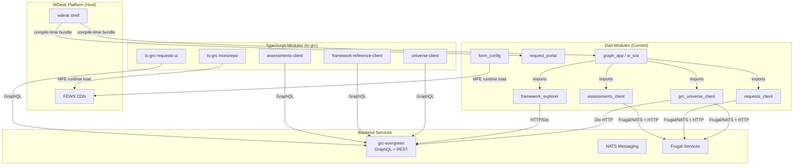
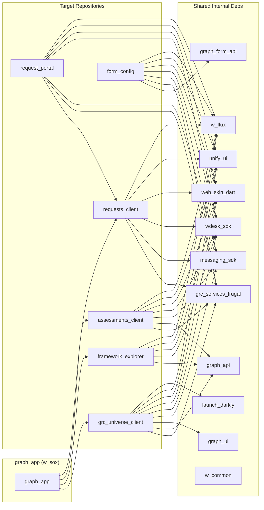
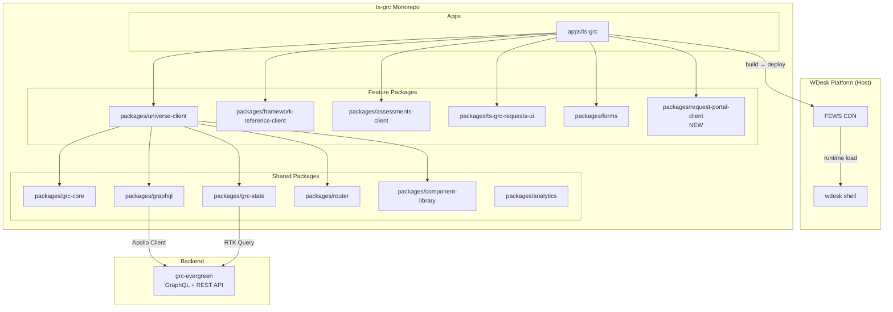
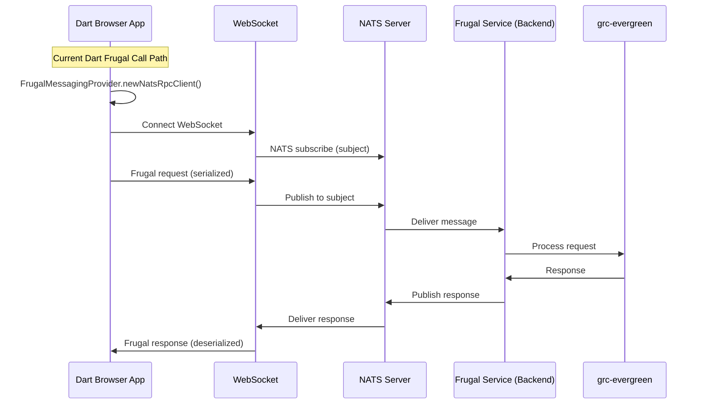
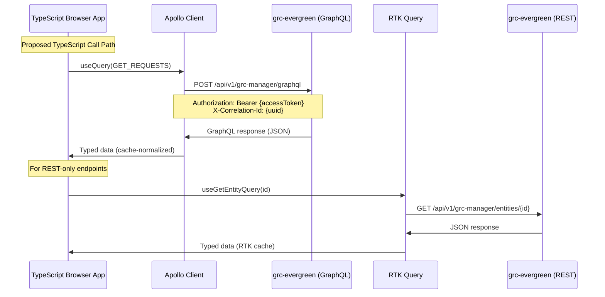
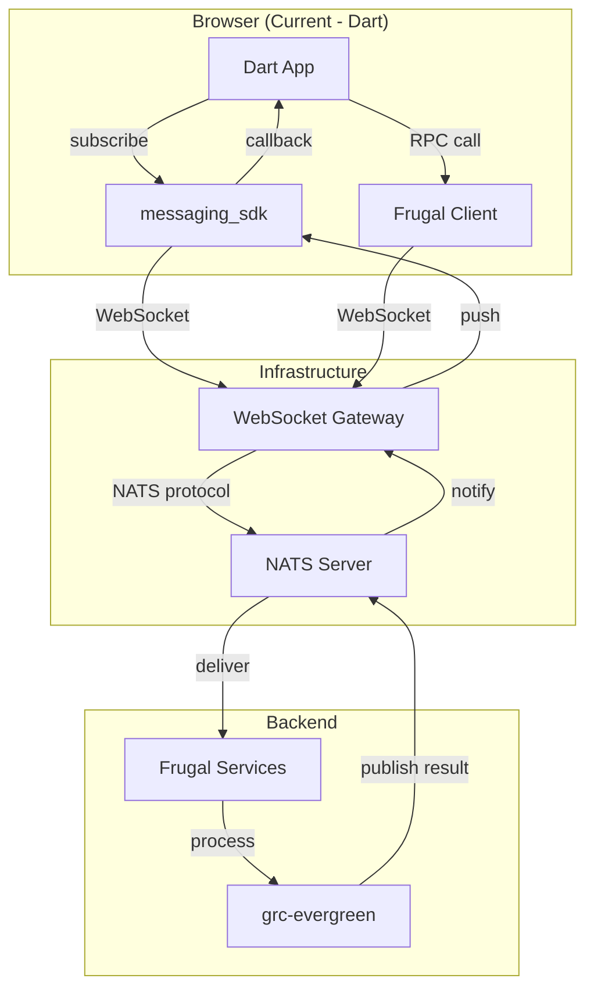
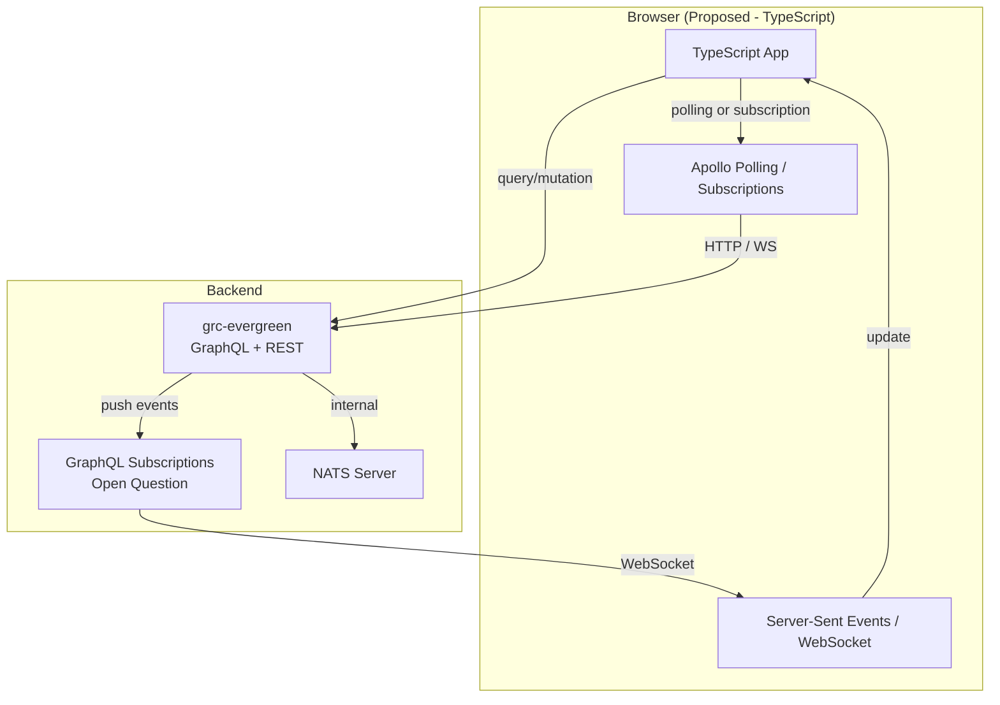
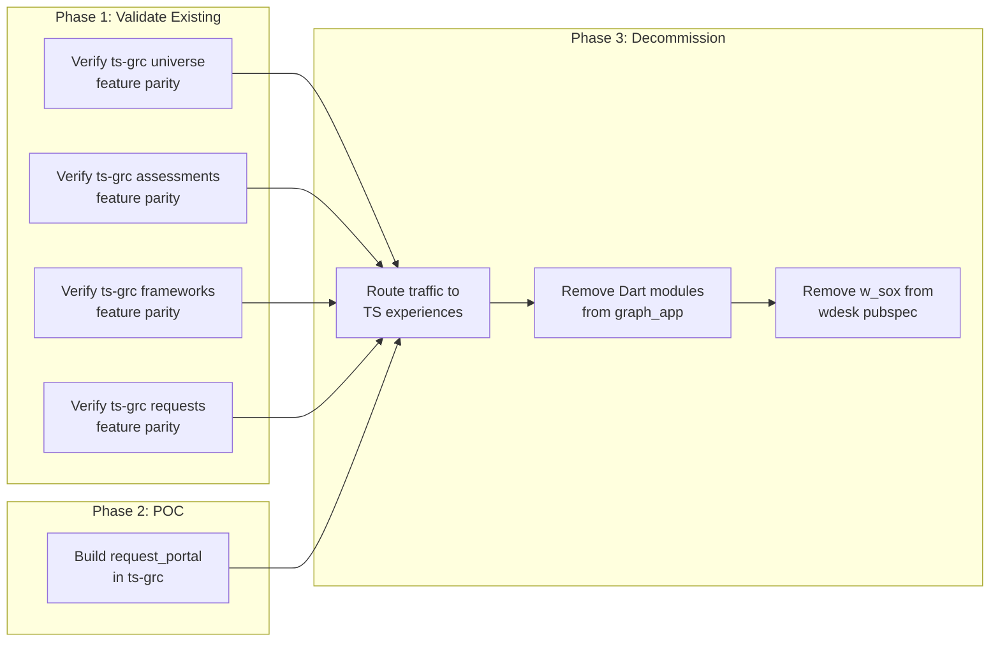

# Dart/OverReact to TypeScript/React Migration — POC Analysis & Technical Assessment

> **Date:** 2026-08-19
> **Author:** SA Tools Engineering (AI-assisted analysis)
> **Status:** Draft — for review and team discussion
> **Scope:** grc_universe_client, framework_explorer, assessments_client, form_config, requests_client, request_portal
> **Reference:** [SD-16950 — Language Translator Client TypeScript Migration](https://jira.atl.workiva.net/browse/SD-16950)
> **Org Context:** Accelerating Organization-Wide TypeScript Adoption (Buendia & Pauzé, Oct 2025)

---

## Table of Contents

1. [Executive Summary](#1-executive-summary)
2. [Organizational Context — Workiva-Wide TypeScript Adoption](#2-organizational-context--workiva-wide-typescript-adoption)
3. [Current-State Architecture](#3-current-state-architecture)
4. [Repository-by-Repository Assessment](#4-repository-by-repository-assessment)
5. [Dependency and Integration Map](#5-dependency-and-integration-map)
6. [Proposed TypeScript Architecture](#6-proposed-typescript-architecture)
7. [UI and Unify Migration Strategy](#7-ui-and-unify-migration-strategy)
8. [Frugal Integration Strategy](#8-frugal-integration-strategy)
9. [NATS Integration Strategy](#9-nats-integration-strategy)
10. [Utilities and Dependency Migration](#10-utilities-and-dependency-migration)
11. [Interoperability and Incremental Migration](#11-interoperability-and-incremental-migration)
12. [Testing, CI/CD, Rollout, and Rollback](#12-testing-cicd-rollout-and-rollback)
13. [POC Recommendation and Implementation Plan](#13-poc-recommendation-and-implementation-plan)
14. [Risks, Assumptions, and Open Questions](#14-risks-assumptions-and-open-questions)
15. [Final Recommendation](#15-final-recommendation)

---

## 1. Executive Summary

This document provides a code-level technical assessment of migrating six Dart/OverReact frontend repositories to TypeScript/React. The analysis is based on direct inspection of source code, dependency manifests, build configurations, and deployment pipelines across all six target repositories, plus three reference implementations.

This assessment also incorporates findings from Workiva's organization-wide **"Accelerating Organization-Wide TypeScript Adoption"** discovery (Buendia & Pauzé, Oct 2025), which identified critical platform blockers, the "Golden Path" incremental MFE strategy, and cross-team adoption timelines that directly impact this GRC migration effort.

### Key Finding

**A production TypeScript/React GRC monorepo (`ts-grc`) already exists and is actively deployed as an MFE.** This monorepo already contains TypeScript implementations of several modules that correspond to the Dart repositories under analysis:

| Dart Repository | ts-grc Equivalent | Status |
|---|---|---|
| `grc_universe_client` | `packages/universe-client`, `packages/ts-grc-universe-ui` | **Production** — deployed as `phoenix-universe` MFE |
| `framework_explorer` | `packages/framework-reference-client` | **Production** — deployed as `phoenix-framework-reference` MFE |
| `assessments_client` | `packages/assessments-client`, `packages/assessments-drawer` | **Production** — deployed as `phoenix-assessments` MFE |
| `requests_client` | `packages/ts-grc-requests-ui` | **Production** — deployed as `phoenix-request-for-task-portal` MFE |
| `form_config` | N/A (no ts-grc equivalent) | **Dart MFE** — already independently deployed |
| `request_portal` | N/A (still bundled in wdesk) | **Not yet migrated** |

This fundamentally changes the migration strategy. Rather than building greenfield TypeScript replacements, the path forward is:

1. **For modules already in ts-grc:** Validate feature parity, route remaining traffic to the TypeScript MFE, and decommission the Dart version.
2. **For `form_config`:** Already an independently deployed Dart MFE — lowest migration priority since it has deployment independence.
3. **For `request_portal`:** The best POC candidate — still bundled in wdesk, has a partial ts-grc counterpart (`ts-grc-requests-ui`), and has moderate complexity.

### Migration Strategy Summary

- **Architecture:** TypeScript MFE packages within the `ts-grc` pnpm monorepo, deployed via FEWS
- **UI Framework:** React 18 + Unify (`@workiva/unify`) + MUI, replacing OverReact + web_skin_dart
- **API Layer:** Apollo Client (GraphQL) + RTK Query (REST/OpenAPI), replacing Frugal/NATS
- **State Management:** Redux Toolkit + Apollo cache, replacing w_flux + Redux
- **Build:** Vite + `@workiva/vite-plugin-microfrontend`, replacing dart2js + wdesk_sdk_builders
- **Host Integration:** `@workiva/microfrontend` ESM extensions with drawer experience contributions
- **Deployment:** FEWS CDN with independent `pipeline_template.yaml` per MFE

### Estimated Effort

| Scenario | Effort | Timeline |
|---|---|---|
| POC (request_portal only) | 4–6 weeks (2 engineers) | Q4 2026 |
| Full migration (all 6 repos) | 16–24 weeks (3–4 engineers) | Q1–Q2 2027 |
| Feature parity validation (modules already in ts-grc) | 2–4 weeks per module | Ongoing |

---

## 2. Organizational Context — Workiva-Wide TypeScript Adoption

> **Source:** "Accelerating Organization-Wide TypeScript Adoption" — Discovery findings from Briana Buendia & Dustin Pauzé (Oct 27, 2025), covering DPC, RRPL, Wdata, ESG, SCM, ANC, AI Squad.

### The Strategic Imperative

The organization-wide TypeScript initiative has established that **incremental MFE replacement is the "Golden Path"** for migrating off Dart/WebSkinDart. A complete "rip and replace" rewrite of large Dart monoliths is deemed **unfeasible**. The primary objective is to **stop adding technical debt** by mandating all greenfield development be in TypeScript.

GRC's `ts-grc` monorepo is well ahead of this curve — it is already a production TypeScript MFE with 20+ experiences deployed. This positions GRC as a **model for the organization**, not a laggard.

### Critical Platform Blockers Affecting This Migration

The org-wide discovery identified five hard blockers that the GRC team must account for:

| # | Blocker | Org Status (H1 2026 target) | Impact on GRC Migration |
|---|---|---|---|
| **1** | **Frugal Replacement (RPC/PubSub)** | **Hard Blocker** — Frugal is not supported in TypeScript. A viable non-Frugal replacement for RPC and a Pub-sub solution (e.g., straight NATS) is a mandatory prerequisite. | **Mitigated for GRC:** ts-grc already uses GraphQL + REST instead of Frugal. The backend (`grc-evergreen`) serves both Frugal (legacy Dart) and GraphQL (ts-grc). However, modules still on Dart Frugal (requests_client, request_portal) need backend GraphQL coverage verified. |
| **2** | **w_outline Replacement** | **Critical** — `w_outline` renders large virtualized data structures (tens of thousands of nodes). Required for Taxonomy Analyzer, ESG Explorer, etc. | **Impacts `framework_explorer`:** The Dart version uses `w_outline` for the left-panel framework hierarchy tree. The ts-grc `framework-reference-client` appears to have solved this independently, but the ESG team's outline work should be tracked as a shared dependency. |
| **3** | **Dynamic Shell/UI APIs** | **Critical** — TS mechanism needed for dynamically adding/removing UI panels in experiences (RichExperience/DrawerExperience). | **Mitigated for GRC:** ts-grc already uses `@workiva/drawer_experience_contribution` + `@workiva/microfrontend` for this. The `TsGrcDrawerExperience` class handles mount/unmount lifecycle. However, `request_portal`'s `RichExperience` patterns (DataPanel, HistoryPanel, CommentsPanel as child modules) may need the TS shell API for panel contribution. |
| **4** | **DPC MF API / Proxies** | **In progress** — Infrastructure for TS panels to communicate with DPC state, Frugal, and Skaar. | **Low impact for GRC:** GRC modules are self-contained and don't depend on DPC state. However, document-embedding experiences (e.g., graph_markup_viewer) may need DPC proxies. |
| **5** | **Standardized CI/Monorepo Tooling** | **Needed** — Guidelines for Dart/TS interop in same repo, pnpm management, CI/CD retrofitting. | **Mitigated for GRC:** ts-grc already has a mature pnpm monorepo with CI (GitHub Actions), Vite build, ESLint, Prettier, and comprehensive CLAUDE.md conventions. New packages follow established patterns. |

### How GRC Aligns with the Organizational Strategy

| Org Recommendation | GRC Status | Action Needed |
|---|---|---|
| **Action 1: Eliminate Hard Blockers** (Frugal, w_outline, Shell APIs) | GraphQL replaces Frugal in ts-grc; MFE SDK replaces shell APIs | Verify GraphQL coverage for request_portal operations; track w_outline TS work for framework_explorer |
| **Action 2: Define the Golden Path** (templates, Dart/TS coexistence, testing) | ts-grc is a living reference implementation with documented conventions | Share ts-grc patterns as organizational template; document Dart↔TS coexistence for graph_app |
| **Action 3: AI as Lever** (TS prerequisite for AI-first development) | ts-grc already integrates AI (`@workiva/ts-grc-agent-service`, `gen_ai_mfe_service`) | Frame request_portal POC as enabling AI-augmented request workflows |
| **Action 4: Workback Plan** (Dart 3 containment) | Most Dart repos are on Dart 2.x with `sound_null_safety: false` | Dart 3 migration is unnecessary if TS migration is the target; avoid investing in Dart 3 for repos being migrated |
| **Action 5: SteerCo & Governance** | No formal SteerCo participation identified | Engage with TS SteerCo to align GRC migration timeline with org priorities |

### GRC's Position in the Org-Wide Adoption Landscape

The discovery identified tractable 2026 opportunities across product teams. GRC is notably **ahead of most teams**:

| Team | 2026 Opportunity | Status |
|---|---|---|
| **GRC (this assessment)** | Already has production TS MFE with 20+ experiences; POC for remaining modules | **Leading adopter** — can share patterns with other teams |
| RRPL | Agentic 10-K, Disclosure Benchmarking, Taxonomy Analyzer 2 | Planning TS adoption for H1 2026; **blocked on w_outline** |
| AI Squad | Custom Intelligence knowledge base (greenfield TS) | Building from scratch in TS |
| ESG | Report Generator, ESG Explorer outline rework | Reworking outline in TS; **beach head project active** |
| SCM | Entity 360 drawer experience MFE | Active TS projects; EAP offering |
| DPC | Small library/package migration; ruler bar conversion | Rarely greenfield; incremental conversion |
| Wdata | BI tool integration via MFE | Planning TS/MFE for data products |
| ANC / Processes | Entity Oversight (large new feature) | Intends to discuss TS for new features |
| ANC / Scripting | Convert scripting app to TS before GA | Side panel as starting point |

### Implications for This POC

1. **Frugal is NOT a blocker for GRC** — unlike most teams, ts-grc has already solved the Frugal replacement by using GraphQL. The request_portal POC can proceed without waiting for the org-wide Frugal replacement.

2. **The POC validates the Golden Path** — A successful request_portal migration demonstrates the incremental MFE replacement strategy that the org has endorsed as the standard approach.

3. **Dart 3 containment is moot** — Rather than investing in Dart 3 null-safety migration for these repos, the GRC team should redirect that effort toward completing the TypeScript migration.

4. **Testing strategy needs definition** — The org-wide analysis highlights functional testing as an unresolved question. The POC should establish the Playwright-based functional testing approach that can serve as a template for other teams.

5. **AI opportunity** — Framing the migration as enabling AI-first development (the org's strongest adoption lever) will help secure executive support and resource allocation through the SteerCo.

---

## 3. Current-State Architecture

### System Overview

The six Dart repositories are frontend modules within the Workiva GRC (Governance, Risk, and Compliance) platform. They are built with Dart, use OverReact (Workiva's Dart React wrapper) for UI, and integrate with the WDesk platform through `wdesk_sdk`.



### Integration Model

**Compile-time bundling (graph_app modules):** `grc_universe_client`, `framework_explorer`, `assessments_client`, and `requests_client` are all dependencies of `graph_app` (published as `w_sox`). The `wdesk` shell compiles `w_sox` into its monolithic JavaScript bundle. These modules cannot be deployed independently.

**Compile-time bundling (request_portal):** `request_portal` is listed in `wdesk/pubspec.yaml` as `request_portal: ^4.0.93` and its experiences are statically registered in `wdesk/lib/src/experience_registry.dart`. It is bundled into wdesk at compile time.

**MFE runtime loading (form_config):** `form_config` is the sole production Dart MFE among the six repositories. It uses `wdesk_sdk_builders|mfe`, `createMfe()`, and `WdeskExtension` to register contributions at runtime. It has its own `pipeline_template.yaml` for independent deployment.

**MFE runtime loading (ts-grc):** The TypeScript monorepo deploys multiple MFE extensions (universe, assessments, frameworks, requests, remediation, etc.) to FEWS, loaded at runtime by the wdesk shell.

### Technology Stack Comparison

| Aspect | Current (Dart) | Target (TypeScript) |
|---|---|---|
| Language | Dart 2.x (sound null safety disabled in some repos) | TypeScript 5.7+ |
| UI Framework | OverReact 5.x (Dart React wrapper) | React 18.3 (native) |
| Component Library | web_skin_dart / unify_ui (Dart wrappers) | @workiva/unify 2.x (native React) |
| State Management | w_flux 3.x + Redux 5.x | Redux Toolkit 2.x |
| API Client (Primary) | Frugal (NATS + HTTP transports) | Apollo Client 4.x (GraphQL) |
| API Client (REST) | Dio / http_client | RTK Query with OpenAPI codegen |
| Router | w_module / wdesk_sdk experience routing | react-router-dom 6.x |
| Build System | dart2js via wdesk_sdk_builders | Vite 6.x + @workiva/vite-plugin-microfrontend |
| Package Manager | pub (pub.workiva.org) | pnpm 10.x (workspace monorepo) |
| Test Framework | dart_test / test | Vitest 4.x + React Testing Library |
| i18n | intl / w_intl (Dart) | react-intl 6.x + @workiva/w_intl_ts |
| Feature Flags | launch_darkly (Dart) | @workiva/grc-launch-darkly + @workiva/feature-flags |
| Logging | logging (Dart) | @workiva/grc-logger |
| Analytics | analytics / user_analytics (Dart) | @workiva/ts-grc-analytics + @workiva/analytics |
| MFE SDK | wdesk_sdk (Dart) | @workiva/microfrontend + @workiva/drawer_experience_contribution |

---

## 4. Repository-by-Repository Assessment

### 4.1 grc_universe_client

**Purpose:** The GRC Universe module — provides the main controls and risks management interface including list views, detail panels, charts, bulk operations, and data import/export.

**Type:** Library package (consumed by `graph_app`)

**Key Files Inspected:**
- `pubspec.yaml` — Package config and dependencies
- `lib/src/universe/` — Core module code
- `lib/src/universe/redux/` — State management (Redux + thunks)
- `lib/src/universe/ui/` — OverReact components
- `lib/src/mfe/` — MFE experience contribution
- `lib/src/gen/` — Generated code (Frugal models)
- `test/` — Test infrastructure

**Dependencies (from pubspec.yaml):**
- **OverReact:** `over_react: ^5.7.0`, `over_react_test: ^4.1.0`
- **State:** `redux: ^5.0.0`, `redux_thunk: ^0.4.0`, `w_flux: ^3.0.3`
- **API:** `dio: ^4.0.0`, `graph_api`, `graph_form_api`, `grc_services_frugal`, `licensing_frugal`
- **UI:** `web_skin_dart`, `unify_ui`, `highcharts_dart`
- **Platform:** `wdesk_sdk: ^9.25.2`, `messaging_sdk: ^3.33.7`, `launch_darkly: ^2.12.37`
- **Utilities:** `w_common`, `built_collection`, `built_value`, `collection`

**OverReact Usage (~50+ components):**
- Uses both legacy `UiComponent` and modern `UiComponent2` patterns
- Flux components via `FluxUiComponent2` for store-connected views
- Props mixins, state mixins, lifecycle methods
- Complex table components, chart wrappers (Highcharts), filter panels, bulk action menus
- `ConnectedComponent` pattern wrapping Redux store access

**Frugal/API Integration:**
- `grc_services_frugal` — Generated Frugal client for GRC backend services
- `licensing_frugal` — Licensing service calls
- `graph_api` / `graph_form_api` — Graph service API clients
- `Dio` for HTTP REST calls
- Redux thunks make API calls and dispatch results to the store

**NATS Integration:**
- Indirect — via `messaging_sdk` for real-time updates and cross-module communication
- NATS messaging client passed through module initialization
- Used for receiving async operation status updates

**State Management:**
- Redux store with thunk middleware
- `UniverseState` as root state with sub-states for controls, risks, filters, charts
- `MiddlewareContext` provides access to API clients, navigator, feature flags

**ts-grc Equivalent:** `packages/universe-client` + `packages/ts-grc-universe-ui`
- **Already in production** as `phoenix-universe` MFE
- Uses Apollo Client (GraphQL) instead of Frugal
- Uses Unify + MUI instead of web_skin_dart
- Uses Redux Toolkit instead of w_flux
- Has 60+ workspace dependencies within ts-grc

**POC Candidacy:** **Poor** — Very large module (~50+ components), heavy dependency coupling, already has production TypeScript equivalent. Migration work should focus on feature parity validation of the existing ts-grc universe-client.

---

### 4.2 framework_explorer

**Purpose:** Framework reference catalog and administration — allows users to browse, search, and manage compliance framework references (e.g., SOX, COSO, ISO 27001).

**Type:** Library package (consumed by `graph_app`)

**Key Files Inspected:**
- `pubspec.yaml` — Package dependencies
- `lib/src/` — Core module code
- `lib/src/components/` — OverReact components
- `lib/src/models/` — Data models
- `lib/src/services/` — API service layer
- `test/` — Test structure
- `.github/workflows/ci.yml` — CI pipeline
- `build.yaml` — Build configuration

**Dependencies (from pubspec.yaml):**
- **OverReact:** `over_react: ^5.7.0`
- **State:** `redux: ^5.0.0`, `w_flux: ^3.0.3`
- **API:** `dio: ^4.0.0`, `graph_api`
- **UI:** `web_skin_dart`, `unify_ui`
- **Platform:** `wdesk_sdk: ^9.25.2`, `launch_darkly: ^2.12.37`

**OverReact Usage (~20–30 components):**
- Moderate complexity — list views, detail panels, search/filter
- Tree views for framework hierarchies
- `UiComponent2` pattern predominantly
- Some Flux store components for data binding

**API Integration:**
- Primarily HTTP/REST via `Dio`
- `graph_api` for graph service calls
- Less Frugal dependency than other modules — more REST-oriented

**NATS Integration:**
- Minimal — primarily through `messaging_sdk` for cross-module events
- No direct NATS service calls identified

**ts-grc Equivalent:** `packages/framework-reference-client`
- **Already in production** as `phoenix-framework-reference` MFE
- Uses Apollo Client (GraphQL) + Unify + react-hook-form
- Clean, smaller package with focused dependencies

**w_outline Dependency (Org Blocker #2):** The Dart version uses `w_outline` for the left-panel framework hierarchy tree (rendering large virtualized structures with tens of thousands of nodes). The org-wide TypeScript discovery identifies `w_outline` replacement as a **critical platform dependency** also blocking RRPL's Taxonomy Analyzer 2 and ESG's Explorer rework. The ts-grc `framework-reference-client` appears to have solved this independently. **Action:** Verify whether ts-grc's tree implementation can serve as a reusable pattern for other teams, and track the ESG team's outline rework as a potential shared component.

**POC Candidacy:** **Poor** — Already has a production TypeScript equivalent. Focus should be on feature parity validation.

---

### 4.3 assessments_client

**Purpose:** Assessment campaigns management — supports creating, distributing, responding to, and reviewing assessments (questionnaires) for GRC compliance workflows.

**Type:** Library package (consumed by `graph_app`)

**Key Files Inspected:**
- `pubspec.yaml` — Dependencies
- `lib/src/` — Core module code
- `lib/src/components/` — OverReact UI components
- `lib/src/stores/` — Flux/Redux stores
- `lib/src/services/` — API layer
- `lib/src/models/` — Data models
- `test/` — Test infrastructure

**Dependencies (from pubspec.yaml):**
- **OverReact:** `over_react: ^5.7.0`
- **State:** `w_flux: ^3.0.3`, `redux: ^5.0.0`
- **API:** `dio`, `graph_api`, `grc_services_frugal`
- **UI:** `web_skin_dart`, `unify_ui`
- **Platform:** `wdesk_sdk`, `messaging_sdk`, `launch_darkly`

**OverReact Usage (~30–40 components):**
- Complex form-heavy UI — assessment question builders, response editors
- Multi-step wizards for campaign creation
- Tabbed interfaces, accordions, rich text editors
- Status workflow components (draft -> in progress -> completed -> reviewed)

**Frugal/API Integration:**
- `grc_services_frugal` for assessment CRUD operations
- Frugal client calls through the standard service pattern
- Assessment response submission through NATS-backed Frugal calls

**NATS Integration:**
- Used for real-time assessment status updates
- Task portal integration — assessment tasks sent via NATS
- `messaging_sdk` for subscription to assessment completion events

**ts-grc Equivalent:** `packages/assessments-client` + `packages/assessments-drawer` + `packages/create-assessments`
- **Already in production** as `phoenix-assessments` MFE
- Also deployed to task_portal as `phoenix-assessments-for-task-portal`
- Uses Apollo Client (GraphQL) + react-hook-form for form handling
- Comprehensive implementation with task portal integration

**POC Candidacy:** **Poor** — Already has production TypeScript equivalent. Complex form-heavy module. Focus on feature parity validation.

---

### 4.4 form_config

**Purpose:** Form configuration and customization — allows administrators to configure custom form fields, layouts, and validation rules for GRC data entry forms.

**Type:** **MFE application** (independently deployed — the only Dart MFE among the six)

**Key Files Inspected:**
- `form_config/pubspec.yaml` — Package config
- `form_config/web/form_config_example.mfe.dart` — MFE entry point
- `form_config/web/extensions/form_config_example/extension.dart` — WdeskExtension class
- `form_config/web/manifest.yaml` — MFE manifest
- `form_config/build.yaml` — Build config with MFE builder
- `pipeline_template.yaml` — Independent deployment pipeline
- `.github/workflows/ci.yaml` — CI pipeline

**MFE Architecture (Reference Pattern):**
```dart
// form_config/form_config/web/form_config_example.mfe.dart
import 'package:wdesk_sdk/create_mfe.dart';
void main() async {
  writeMfeBuildMetadataToWindow();
  await createMfe(
    assetLoader: assetLoader,
    intlName: 'form_config',
    mfeName: 'form_config_example',
  );
  FormConfigExampleExtension(assetLoader);
}
```

**Deployment:**
- Independent `pipeline_template.yaml` with stages: wk-dev -> staging -> Signals tests -> pentest -> sandbox -> demo -> APAC -> EU -> prod
- FEWS CDN deployment (no Docker image needed)
- Slack alerts on failure to `alert-form-config`

**Dependencies (from pubspec.yaml):**
- **OverReact:** `over_react: ^5.7.0`
- **MFE SDK:** `wdesk_sdk` with `wdesk_sdk_builders|mfe` builder
- **State:** `w_flux`, `redux`
- **API:** `graph_form_api`, `grc_services_frugal`
- **UI:** `web_skin_dart`, `unify_ui`

**OverReact Usage (~15–25 components):**
- Form builders, field configurators, layout editors
- Drag-and-drop field ordering
- Preview/publish workflow
- Moderate complexity — well-bounded scope

**Frugal/API Integration:**
- `graph_form_api` — Form configuration CRUD
- `grc_services_frugal` — Shared GRC services

**NATS Integration:**
- NATS messaging client obtained through `WdeskExtension.onRegisterServices()`
- Used for form publish notifications
- Standard `messaging_sdk` patterns

**ts-grc Equivalent:** `packages/forms` exists but scope/parity is **unclear** — needs investigation.

**POC Candidacy:** **Moderate** — Already independently deployed as MFE (has deployment infrastructure). However, migrating an already-independent Dart MFE to TypeScript provides less incremental value than migrating a bundled module. The MFE pattern is well-documented here and serves as reference rather than needing migration itself. Migration could be done by creating a TypeScript equivalent in ts-grc that registers the same manifest contribution points.

---

### 4.5 requests_client

**Purpose:** Request management — handles the lifecycle of GRC requests including creation, assignment, response, review, return, and approval. Requests are a core workflow primitive in the GRC platform.

**Type:** Library package (consumed by `graph_app`)

**Key Files Inspected:**
- `pubspec.yaml` — Dependencies
- `lib/src/shared/services/base_frugal_service.dart` — Frugal base service pattern
- `lib/src/shared/services/audit_request_services.dart` — Request API services
- `lib/src/shared/models/` — Data models and translators
- `lib/src/experiences/` — Experience implementations
- `lib/src/task_portal/` — Task portal integration
- `lib/src/environment.dart` — Environment configuration
- `test/` — Test structure

**Dependencies (from pubspec.yaml):**
- **OverReact:** `over_react: ^5.7.0`
- **State:** `w_flux: ^3.0.3`, `redux: ^5.0.0`
- **API:** `frugal: ^3.x`, `grc_services_frugal`, `messaging_sdk`
- **UI:** `web_skin_dart`, `unify_ui`
- **Platform:** `wdesk_sdk`, `launch_darkly`

**Frugal Integration (Heavy — Key Pattern):**

The `BaseFrugalService` in `lib/src/shared/services/base_frugal_service.dart` is the canonical Frugal integration pattern:

```dart
abstract class BaseFrugalService<C extends Disposable> extends Disposable {
  // Dual transport: NATS and HTTP
  C? natsClient;  // NATS-backed Frugal client
  C? httpClient;  // HTTP-backed Frugal client

  Future<void> connectNats() async {
    natsClient = await _frugalMessagingProvider.newNatsRpcClient<C>(
      _serviceDescriptor, _frugalClientFactory,
      retryConfig: NatsAutoRetryConfig.nonIdempotent(),
    );
  }

  void connectHttp() {
    httpClient = _frugalMessagingProvider.newHttpRpcClient<C>(
      _serviceDescriptor, _frugalClientFactory,
    );
  }

  Future<T> makeServiceCall<R, T>(
    Future<R> Function(FContext) serviceCall, {
    required String methodName,
    required T Function(R) responseProcessor,
  }) async {
    final context = _frugalMessagingProvider.createFContext()
      ..timeout = _serviceCallTimeout;
    // Adds draft session header, correlation ID, logging
    final R response = await serviceCall(context);
    return responseProcessor(response);
  }
}
```

**NATS Integration:**
- Direct NATS connections through Frugal's NATS transport
- Used for request submission, response, approval workflows
- Real-time status updates via `messaging_sdk` subscriptions
- Task portal request tasks sent/received via NATS

**OverReact Usage (~25–35 components):**
- Request list views with filtering, sorting, bulk actions
- Request detail panels with response forms
- Task portal request experience
- Status workflow indicators
- Evidence attachment UI

**ts-grc Equivalent:** `packages/ts-grc-requests-ui`
- **Partially in production** — deployed as `phoenix-request-for-task-portal`
- Task portal integration exists
- GraphQL-based API layer
- Moderate feature parity — list and detail views exist, some workflows may be incomplete

**POC Candidacy:** **Good** — Representative Frugal/NATS patterns, moderate complexity, partial ts-grc counterpart to build on, task portal integration already working in TypeScript.

---

### 4.6 request_portal

**Purpose:** External request portal — a simplified interface for external users (non-GRC admins) to view and respond to assigned requests. Provides a focused, task-oriented view of request activities.

**Type:** **Application** (bundled in wdesk — NOT an MFE)

**Key Files Inspected:**
- `pubspec.yaml` — Package config
- `web/main.dart` — Application entry point
- `lib/src/` — Core application code
- `lib/src/components/` — OverReact components
- `lib/src/services/` — API services
- `lib/src/stores/` — State management
- `lib/src/models/` — Data models
- `build.yaml` — Build configuration
- `.github/workflows/ci.yml` — CI pipeline

**Integration with wdesk:**
- Listed in `wdesk/pubspec.yaml` as `request_portal: ^4.0.93`
- Experiences statically registered in `wdesk/lib/src/experience_registry.dart`
- Compiled into the wdesk monolith — NO independent deployment
- Uses `wdesk_sdk_builders:app` (not MFE builder)

**Dependencies (from pubspec.yaml):**
- **OverReact:** `over_react: ^5.7.0`
- **State:** `w_flux: ^3.0.3`, `redux: ^5.0.0`
- **API:** `grc_services_frugal`, `messaging_sdk`, `frugal`
- **UI:** `web_skin_dart`, `unify_ui`
- **Platform:** `wdesk_sdk: ^9.0.0`, `launch_darkly`
- **Shared:** Depends on `requests_client` for shared request models and services

**OverReact Usage (~15–20 components):**
- Simpler UI than the full requests_client
- Request response forms, attachment upload
- Status indicators, progress tracking
- Task list views
- Focused scope — portal view only

**Frugal/API Integration:**
- Reuses services from `requests_client`
- Standard Frugal patterns for request operations
- HTTP and NATS transports

**NATS Integration:**
- Via `messaging_sdk` — receives request assignment notifications
- Real-time status updates
- Standard patterns inherited from `requests_client`

**ts-grc Equivalent:** Partial — `ts-grc-requests-ui` covers some request functionality, and `phoenix-request-for-task-portal` handles the task portal integration. The full portal experience may need additional TypeScript work.

**POC Candidacy:** **Best** — See Section 12 for detailed rationale.

---

## 5. Dependency and Integration Map

### Cross-Repository Dependency Graph



### Dependency Classification

#### Third-Party External Dependencies

| Dart Package | Used By | TypeScript Equivalent | Migration Action |
|---|---|---|---|
| `redux` / `redux_thunk` | All 6 repos | `@reduxjs/toolkit` | Replace — RTK is a superset |
| `built_value` / `built_collection` | GUC, AC, RC | Native TS types / interfaces | Replace — TS has native immutability patterns |
| `dio` | GUC, FE | `fetch` / Apollo Client / RTK Query | Replace |
| `collection` | GUC, FE, AC | lodash / native JS | Replace |
| `logging` | All 6 repos | `@workiva/grc-logger` | Replace |
| `intl` | All 6 repos | `react-intl` + `@workiva/w_intl_ts` | Replace |
| `meta` | All 6 repos | N/A (TypeScript decorators) | Remove |
| `quiver` | GUC, AC | lodash / native JS | Replace |
| `uuid` | RC, RP | `uuid` npm package | Replace (same concept) |

#### Workiva Internal Dependencies

| Dart Package | Used By | TypeScript Equivalent | Migration Action |
|---|---|---|---|
| `wdesk_sdk` | All 6 repos | `@workiva/microfrontend` + `@workiva/drawer_experience_contribution` | Replace |
| `over_react` | All 6 repos | React 18 (native) | Replace |
| `web_skin_dart` / `unify_ui` | All 6 repos | `@workiva/unify` (native React) | Replace |
| `w_flux` | All 6 repos | `@reduxjs/toolkit` | Replace |
| `messaging_sdk` | GUC, AC, RC, RP, FC | Backend service layer (not browser-direct) | Architecture change |
| `launch_darkly` | All 6 repos | `@workiva/grc-launch-darkly` + `@workiva/feature-flags` | Replace |
| `grc_services_frugal` | GUC, AC, RC, RP, FC | Apollo Client (GraphQL) + RTK Query (REST) | Replace |
| `graph_api` | GUC, FE, AC | `@workiva/graphql` (Apollo) | Replace |
| `graph_form_api` | FC | `@workiva/graphql` (Apollo) | Replace |
| `graph_ui` | GUC | `@workiva/ts-grc-component-library` | Replace |
| `w_common` | All 6 repos | Native TS utilities | Remove |
| `analytics` / `user_analytics` | All 6 repos | `@workiva/ts-grc-analytics` + `@workiva/analytics` | Replace |
| `app_intelligence` | GUC, AC | `@workiva/analytics` | Replace |

#### Generated Dependencies

| Dart Package | Used By | TypeScript Equivalent | Migration Action |
|---|---|---|---|
| `grc_services_frugal` (generated) | GUC, AC, RC, RP, FC | GraphQL schema + RTK Query codegen | Replace with codegen |
| `licensing_frugal` | GUC | GraphQL query or REST API | Replace |
| `built_value` generated models | GUC, AC | TypeScript interfaces (auto-generated from GraphQL schema) | Replace with codegen |

#### Build and Development Dependencies

| Dart Package | Used By | TypeScript Equivalent | Migration Action |
|---|---|---|---|
| `wdesk_sdk_builders` | All 6 repos | `@workiva/vite-plugin-microfrontend` | Replace |
| `build_runner` / `build_web_compilers` | All 6 repos | Vite + Rollup | Replace |
| `dart_dev` | All 6 repos | pnpm scripts | Replace |
| `over_react_test` | All 6 repos | `@testing-library/react` | Replace |
| `test` / `dart_test` | All 6 repos | Vitest | Replace |
| `mockito` | Some repos | Vitest mocks (`vi.mock`, `vi.fn`) | Replace |

---

## 6. Proposed TypeScript Architecture

### Target Architecture

The migration target is **adding packages to the existing `ts-grc` monorepo** — not creating new standalone repositories. This is the established pattern confirmed by the 70+ packages already in ts-grc.



### MFE Entry Point Pattern

Each feature module registers as an MFE extension in `apps/ts-grc/manifest.yaml` and has a corresponding entrypoint in `apps/ts-grc/src/`:

```typescript
// apps/ts-grc/src/request_portal.ts (proposed new entry point)
import {
  DrawerExperienceContributionHost,
  DrawerExperienceContribution,
  DrawerExperience,
} from '@workiva/drawer_experience_contribution';
import { createEsmExtension } from '@workiva/microfrontend';
import { requestPortalRouterSettings } from '@workiva/request-portal-client';
import { TsGrcDrawerExperience } from './experience/TsGrcDrawerExperience';

class RequestPortalExperienceContribution extends DrawerExperienceContribution {
  readonly extensionName: string = 'phoenix-request-portal';
  readonly simpleName: string = 'request-portal';

  async openExperience(): Promise<DrawerExperience> {
    return new TsGrcDrawerExperience(requestPortalRouterSettings);
  }
}

export default createEsmExtension({
  contributions: [
    new DrawerExperienceContributionHost(new RequestPortalExperienceContribution()),
  ],
});
```

### Manifest Contribution Pattern

```yaml
# Addition to apps/ts-grc/manifest.yaml
phoenix-request-portal:
  apps: [ wdesk ]
  extensions:
    phoenix-request-portal:
      entrypoint: src/request_portal.ts
      contributions:
        core.drawer_experiences:
          - name: request-portal
            details:
              display_name:
                intl_message_name: requestPortal
                default_text: Request Portal
              can_user_access: "ability.-31"
        core.routing:
          - name: request_portal_route
            details:
              route_segment: request_portal
              experience_name: phoenix-request-portal.core.drawer_experiences.request-portal
```

### Shared Experience Renderer

ts-grc uses a single `TsGrcDrawerExperience` class (found at `apps/ts-grc/src/experience/TsGrcDrawerExperience.tsx`) that:

1. Gets session info from `@workiva/session_mfe_service` (access token, workspace ID, membership ID, user ID)
2. Gets service URIs from `@workiva/wdesk_browser_environment`
3. Renders a `MfeRouter` component that:
   - Creates an Apollo Client with auth
   - Configures Redux store
   - Sets up React Router
   - Wraps in IntlProvider, ThemeProvider, and feature flag providers
4. Handles route changes via `@workiva/navigator_mfe_service`

This architecture is reused by ALL ts-grc experiences — each new module only needs to provide `routerSettings` (routes and components).

### Should Every Package Become an MFE?

**No.** Based on evidence from the ts-grc architecture:

| Package Type | MFE? | Rationale |
|---|---|---|
| Feature clients (`*-client`) | Yes — register as drawer experiences | Each feature client has its own route segment and experience contribution |
| Shared libraries (`grc-core`, `grc-state`, `graphql`) | No | Bundled into the ts-grc app at build time, shared by all features |
| UI component libraries (`component-library`, `*-ui`) | No | Consumed by feature clients, no independent runtime |
| Utility packages (`router`, `analytics`, `test-utils`) | No | Build-time dependencies only |

The `apps/ts-grc/` application bundles all feature packages into a single deployable artifact. Each feature registers its own MFE extension in the manifest, but they share a single build pipeline and JavaScript bundle. This is the **mono-MFE** pattern — one deployable, many extensions.

**Evidence:** The `apps/ts-grc/manifest.yaml` file registers 20+ MFE extensions from a single build artifact, each with its own `entrypoint` pointing to `src/<feature>.ts`.

---

## 7. UI and Unify Migration Strategy

### OverReact to React Pattern Mapping

| Current Dart/OverReact Pattern | Repository Example | TypeScript/React Replacement | Migration Complexity | Risks/Notes |
|---|---|---|---|---|
| `UiFactory<FooProps>` + `UiComponent2<FooProps>` | All repos — standard component | `function Foo(props: FooProps)` | Low | 1:1 mapping; class → function component |
| `FluxUiComponent2` with `FluxUiPropsMixin` | grc_universe_client — store-connected views | `useSelector()` + `useDispatch()` from react-redux | Medium | State shape changes needed |
| `UiProps` mixin composition (`mixin FooProps on UiProps`) | All repos | TypeScript `type FooProps = { ... }` | Low | Flatten mixin hierarchy to single type |
| `UiState` mixin + `initialState` + `setState()` | assessments_client — wizard steps | `useState()` / `useReducer()` hooks | Medium | Class lifecycle → hooks refactor |
| `componentDidMount` / `componentWillUnmount` | All repos | `useEffect()` with cleanup | Low | Standard lifecycle → hooks pattern |
| `getDerivedStateFromProps` | Some components | `useMemo()` / derived from props directly | Low | Often unnecessary in hooks model |
| `forwardRef` + `ref` callbacks | form_config — field configurators | `forwardRef()` / `useImperativeHandle()` | Low | Same concept in React |
| `Dom.div()` / `Dom.span()` (OverReact DOM) | All repos | JSX `<div>` / `<span>` | Low | Syntactic — automated |
| `(FooComponent()..id = 'x'..onClick = handler)()` cascade | All repos | `<FooComponent id="x" onClick={handler} />` | Low | Syntactic — automated |
| `ReduxProvider` / `StoreProvider` | graph_app entry point | `<Provider store={store}>` from react-redux | Low | Same concept |
| `web_skin_dart` Button, Modal, etc. | All repos | `@workiva/unify` Button, Dialog, etc. | Medium | API differences; Unify is native React |
| `unify_ui` components | Some repos | `@workiva/unify` (same library, TS bindings) | Low | Unify already has React/TS components |
| Highcharts (dart wrapper) | grc_universe_client — charts | `highcharts` npm + `@workiva/grc-phoenix-highcharts` | Medium | ts-grc already has wrapper |
| `w_flux` Store + Actions | All repos | Redux Toolkit slice + actions | Medium | Pattern change; reducers replace handlers |
| `built_value` models | GUC, AC | TypeScript interfaces + GraphQL types | Medium | Remove boilerplate; auto-generated from schema |
| `intl` message extraction | All repos | `react-intl` `<FormattedMessage>` / `intl.formatMessage()` | Medium | Different extraction pipeline |
| CSS via `web_skin_dart` mixins | All repos | Unify design tokens + `sx` prop + `getToken()` | Medium | Design system migration |
| `ErrorBoundary` (OverReact) | Some repos | React `ErrorBoundary` component | Low | Same concept |
| Drag and drop (custom implementations) | form_config, grc_universe_client | `@dnd-kit/core` + `@dnd-kit/sortable` | Medium | ts-grc already uses dnd-kit |

### Unify Component Mapping

Unify (`@workiva/unify`) provides **native TypeScript/React components**. It is NOT a wrapper — it is the source-of-truth component library for the Workiva design system in React.

**Verified** (from ts-grc `package.json` files): `@workiva/unify: ^2.32.1` is used across all ts-grc packages.

| Dart (web_skin_dart / unify_ui) | TypeScript (@workiva/unify) | Notes |
|---|---|---|
| `Button` | `Button` | Same API concept; different prop names |
| `Modal` / `ModalDialog` | `Dialog` (MUI-based) | MUI Dialog API |
| `Tabs` / `TabPanel` | `Tabs` / `Tab` | MUI Tabs pattern |
| `TextInput` / `TextField` | `TextField` | MUI TextField |
| `Dropdown` / `Select` | `Select` / `Autocomplete` | MUI patterns |
| `Table` / `DataTable` | `@workiva/ts-grc-data-grid-next` | Custom data grid package |
| `Tooltip` | `Tooltip` | MUI Tooltip |
| `Icon` | Unify icons (`unify.*`) | Icon name mapping needed |
| `Alert` / `AlertDialog` | `Alert` / `AlertTitle` | MUI Alert |
| `Checkbox` / `Radio` | `Checkbox` / `Radio` | MUI patterns |
| `DatePicker` | MUI `DatePicker` | From `@mui/x-date-pickers` |
| `Accordion` | `Accordion` | MUI Accordion |
| `Chip` / `Badge` | `Chip` / `Badge` | MUI components |
| `Popover` / `OverlayTrigger` | `Popover` / `Menu` | MUI patterns |
| `ProgressBar` | `LinearProgress` / `CircularProgress` | MUI patterns |

### Components Requiring Significant Manual Migration

1. **Data tables/grids** — The Dart repos use custom table implementations with sorting, filtering, pagination, column resizing. ts-grc has `@workiva/ts-grc-data-grid-next` which would replace these, but mapping column definitions and cell renderers requires manual work.

2. **Chart components** — Highcharts integration in grc_universe_client needs mapping to `@workiva/grc-phoenix-highcharts` wrapper. Chart configs and data transformations need porting.

3. **Rich text editors** — If any module uses rich text (assessments_client for question/response editing), these need mapping to `@tiptap/core` which ts-grc uses.

4. **Form builders** — form_config's drag-and-drop field configurators are complex custom UI that needs full reimplementation with `react-hook-form` + `@dnd-kit`.

5. **Multi-step wizards** — Assessment campaign creation wizards need careful state machine porting.

### CSS, Styling, and Accessibility

**Current (Dart):** CSS is primarily applied through `web_skin_dart` component mixins and Dart-side style maps.

**Target (TypeScript):** The ts-grc convention is:
- Unify design tokens via `getToken()` from `@workiva/ts-grc-component-library`
- MUI `sx` prop for component-level styles
- Semantic tokens (e.g., `'action/primary/default'`, `'surface/page/default'`)
- No raw CSS files — all styling through the component system

**Accessibility:** Unify components come with built-in ARIA attributes. ts-grc has a component library audit skill (`/component-audit-a11y`) that validates keyboard operability, focus management, ARIA patterns, and disabled states.

### Localization

**Current (Dart):** `intl` package with message extraction via `intl_translation`.

**Target (TypeScript):** `react-intl` with `@formatjs/ts-transformer` for compile-time message ID generation. All user-facing strings must use `<FormattedMessage defaultMessage="..." description="..." />` or `intl.formatMessage()`. IDs are auto-generated — never provide manual IDs.

---

## 8. Frugal Integration Strategy

> **Org-wide context:** The TypeScript Adoption discovery (Oct 2025) identifies Frugal replacement as the **#1 hard blocker** across the organization: *"Frugal is not supported in TypeScript. A viable non-Frugal replacement for RPC and a Pub-sub solution (e.g., Straight NATS) is a mandatory prerequisite for migration."* However, **GRC has already solved this** — ts-grc uses GraphQL + REST instead of Frugal, with `grc-evergreen` serving both protocols to support the transition. This positions GRC ahead of RRPL, DPC, Wdata, and other teams still blocked on Frugal.

### Current Frugal Architecture

Frugal is Workiva's RPC framework that generates typed client/server stubs from Thrift-like IDL definitions. In the Dart frontend, Frugal clients use two transport mechanisms:

1. **NATS transport:** Browser → WebSocket → NATS server → Backend service
2. **HTTP transport:** Browser → HTTP → API gateway → Backend service



### Current Dart Call Path Example (requests_client)

```dart
// lib/src/shared/services/base_frugal_service.dart
class AuditRequestService extends BaseFrugalService<AuditRequestFClient> {
  Future<List<Request>> getRequests(String workspaceId) async {
    await connectNats(); // Establish NATS-backed Frugal connection
    return makeServiceCall(
      (ctx) => natsClient!.getRequests(ctx, workspaceId),
      methodName: 'getRequests',
      responseProcessor: (response) => response.requests.map(Request.fromFrugal).toList(),
    );
  }
}
```

### Proposed TypeScript Call Path

ts-grc does NOT use Frugal at all. Instead, it communicates with the same `grc-evergreen` backend through:

1. **GraphQL** (primary) — Apollo Client talking to `grc-evergreen`'s GraphQL endpoint
2. **REST** (secondary) — RTK Query with OpenAPI-generated clients for endpoints not yet in GraphQL



### TypeScript Call Path Example

```typescript
// packages/graphql/src/schema/requests.graphql (query definition)
query requests_requestlist_listrequests($workspaceId: ID!, $first: Int, $after: String) {
  listRequests(workspaceId: $workspaceId, first: $first, after: $after) {
    edges {
      node {
        id
        name
        status
        assignee { id, name }
        dueDate
      }
    }
    pageInfo { hasNextPage, endCursor }
  }
}

// packages/ts-grc-requests-ui/src/hooks/useRequests.ts (usage)
import { useQuery } from '@apollo/client';
import { graphql } from '@workiva/graphql';

const GET_REQUESTS = graphql(`
  query requests_requestlist_listrequests($workspaceId: ID!) {
    listRequests(workspaceId: $workspaceId) {
      edges { node { id name status assignee { id name } dueDate } }
      pageInfo { hasNextPage endCursor }
    }
  }
`);

export function useRequests(workspaceId: string) {
  return useQuery(GET_REQUESTS, { variables: { workspaceId } });
}
```

### Frugal → GraphQL Migration Strategy

| Aspect | Current (Frugal/Dart) | Target (GraphQL/TypeScript) | Migration Notes |
|---|---|---|---|
| **Client generation** | Frugal IDL → Dart client stubs | GraphQL schema → TypeScript types (auto-generated) | `pnpm codegen:graphql` generates types from `grc-evergreen.graphql` |
| **Transport** | NATS WebSocket or HTTP | HTTPS (Apollo Client `httpLink`) | Simpler — no WebSocket required for queries |
| **Serialization** | Frugal binary/JSON protocol | GraphQL JSON | Standard HTTP/JSON |
| **Authentication** | FContext headers + session | Apollo `authLink` with `Bearer` token | Same auth token, different transport |
| **Error handling** | Frugal exceptions → catch blocks | Apollo `error` field / `onError` link | Different error shape |
| **Caching** | None (Frugal is request/response) | Apollo normalized cache | Major improvement — automatic cache updates |
| **Real-time updates** | NATS subscriptions | Apollo subscriptions (if available) or polling | See NATS section |
| **Timeouts/retries** | `FContext.timeout`, `NatsAutoRetryConfig` | Apollo `RetryLink` / fetch timeout | Configuration-level |
| **Type safety** | Frugal-generated Dart types | GraphQL-generated TypeScript types | Both strongly typed |
| **i64 values** | Dart `int` (64-bit) | GraphQL `ID` or custom scalar → `string` in TS | **Risk:** JavaScript number precision for i64; use string representation |
| **Enums** | Frugal enum → Dart enum | GraphQL enum → TypeScript string union | Different enum semantics |
| **Nullable fields** | Dart nullable (`?`) | GraphQL nullable → TypeScript `| null | undefined` | Similar |
| **Unions** | Frugal union → Dart abstract class | GraphQL union → TypeScript discriminated union | Different pattern |

### Required Build/Code-Generation Changes

1. **Add GraphQL operations** — For any Dart Frugal calls that don't yet have GraphQL equivalents in `grc-evergreen`, work with the backend team to add GraphQL resolvers.

2. **Run GraphQL codegen** — `pnpm --filter graphql get-graphql-schema && pnpm codegen:graphql` generates TypeScript types from the schema.

3. **For REST-only endpoints** — Use `pnpm get-grc-api-oas && pnpm codegen:rest-api` to generate RTK Query API slices from OpenAPI specs.

4. **No Frugal TypeScript generator needed** — ts-grc deliberately avoids Frugal in favor of GraphQL. The `grc-evergreen` backend serves both Frugal (for legacy Dart clients) and GraphQL (for ts-grc) simultaneously.

### Open Questions

- **GraphQL coverage:** Are all Frugal operations used by the 6 Dart repos available as GraphQL queries/mutations in `grc-evergreen`? The 48K-line GraphQL schema is comprehensive but needs verification per operation.
- **Frugal-only operations:** If any operations exist only in Frugal (not GraphQL), they need to be added to `grc-evergreen`'s GraphQL layer before the TypeScript migration can proceed.

---

## 9. NATS Integration Strategy

> **Org-wide context:** The TypeScript Adoption discovery identifies Pub-sub replacement (e.g., "Straight NATS") as part of the Frugal hard blocker. The platform team (FEF) is expected to deliver a replacement by H1 2026. For GRC, ts-grc has already eliminated direct browser NATS usage — all data access goes through GraphQL/REST over standard HTTPS.

### Current NATS Architecture

NATS is used in the Dart frontend through two mechanisms:

1. **Frugal NATS transport** — RPC calls routed over NATS (see Section 7)
2. **messaging_sdk subscriptions** — Real-time event subscriptions for status updates, notifications, and cross-module communication



### How NATS is Used in Each Repository

| Repository | NATS Usage | Subjects/Patterns |
|---|---|---|
| **grc_universe_client** | Status updates for bulk operations, real-time data changes | Universe entity update events |
| **framework_explorer** | Minimal — cross-module navigation events | Standard messaging_sdk patterns |
| **assessments_client** | Assessment completion notifications, campaign status updates, task creation events | Assessment lifecycle events |
| **requests_client** | Request submission/approval notifications, real-time status changes | Request lifecycle events |
| **request_portal** | Inherits from requests_client — assignment notifications | Request assignment events |
| **form_config** | Form publish notifications | Form config change events |

### Security and Network Considerations

**Current Dart architecture:** The browser establishes a WebSocket connection to a gateway that bridges to NATS. Authentication is handled through the session token embedded in the connection handshake. The `messaging_sdk` abstracts this — individual modules don't manage NATS connections directly.

**Key concerns for TypeScript:**
- Browser-based NATS connections require WebSocket support
- Credentials must not be exposed in browser JavaScript
- NATS subject permissions must be enforced server-side
- Connection lifecycle management (reconnection, backpressure)

### Proposed TypeScript Architecture



### Recommended Approach

Based on evidence from ts-grc (which is already in production without direct NATS access):

1. **Do NOT expose NATS directly to the TypeScript browser app.** ts-grc does not use `messaging_sdk` or direct NATS connections. This is a deliberate architectural choice.

2. **Use Apollo Client polling for near-real-time updates.** Many ts-grc components use `pollInterval` on queries to refresh data periodically.

3. **Use GraphQL subscriptions (if available).** Check if `grc-evergreen` supports GraphQL subscriptions for real-time events. If so, Apollo Client can subscribe via WebSocket.

4. **Use backend-mediated event delivery.** For events that require NATS (e.g., cross-module notifications), the backend service should consume NATS events and expose them through a client-friendly channel (GraphQL subscriptions, SSE, or polling endpoints).

5. **For cross-MFE communication:** Use `@workiva/navigator_mfe_service` for navigation events and `@workiva/notification_mfe_service` for user notifications — these are already available in the MFE host context.

### Open Questions

- **Does `grc-evergreen` support GraphQL subscriptions?** If not, what is the plan for real-time event delivery to ts-grc?
- **What NATS-dependent features are critical for each module?** Need to inventory which real-time behaviors users depend on vs. which can be replaced with polling.
- **Is there a platform-level event bus for MFEs?** The wdesk shell may provide an event mechanism for cross-MFE communication.

---

## 10. Utilities and Dependency Migration

### Dart Utility Inventory and Migration Strategy

| Dart Package/Utility | Used By | Responsibility | TypeScript Replacement/Strategy | Effort | Risk |
|---|---|---|---|---|---|
| **w_flux** (stores, actions, dispatcher) | All 6 repos | Flux-style state management | **Replace** with Redux Toolkit slices + hooks | Medium | State shape changes needed |
| **redux** + **redux_thunk** | All 6 repos | Redux store + async middleware | **Replace** with `@reduxjs/toolkit` (includes thunk) | Low | API is very similar |
| **built_value** / **built_collection** | GUC, AC, RC | Immutable value types + code gen | **Replace** with TypeScript interfaces + GraphQL generated types | Medium | Lose runtime validation; gain TS compile-time safety |
| **grc_services_frugal** (generated) | GUC, AC, RC, RP, FC | Generated Frugal client stubs | **Replace** with Apollo Client + RTK Query codegen | High | Requires GraphQL coverage verification |
| **graph_api** / **graph_form_api** | GUC, FE, AC, FC | Graph service API clients | **Replace** with `@workiva/graphql` (Apollo) | Medium | Already done in ts-grc |
| **messaging_sdk** | GUC, AC, RC, RP, FC | NATS messaging abstraction | **Architecture change** — backend-mediated events | High | See Section 8 |
| **wdesk_sdk** (Session, routing, services) | All 6 repos | Host platform SDK | **Replace** with `@workiva/session_mfe_service` + `@workiva/microfrontend` | Medium | Different registration API |
| **launch_darkly** (Dart) | All 6 repos | Feature flag evaluation | **Replace** with `@workiva/grc-launch-darkly` + `@workiva/feature-flags` | Low | Already in ts-grc |
| **analytics** / **user_analytics** | All 6 repos | Event tracking | **Replace** with `@workiva/ts-grc-analytics` + `@workiva/analytics` | Low | Already in ts-grc |
| **app_intelligence** | GUC, AC | Error/performance monitoring | **Replace** with `@workiva/analytics` | Low | Already in ts-grc |
| **logging** (Dart) | All 6 repos | Structured logging | **Replace** with `@workiva/grc-logger` (`createLogger('ts-grc-*')`) | Low | Already in ts-grc |
| **intl** / **w_intl** | All 6 repos | i18n message extraction | **Replace** with `react-intl` + `@workiva/w_intl_ts` | Medium | Different extraction pipeline |
| **web_skin_dart** / **unify_ui** | All 6 repos | Design system components | **Replace** with `@workiva/unify` (native React) | Medium | Component API differences |
| **w_common** (disposable, etc.) | All 6 repos | Utility mixins (disposable, lifecycle) | **Remove** — React hooks handle lifecycle; TS has native patterns | Low | No direct equivalent needed |
| **dio** | GUC, FE | HTTP client | **Replace** with `fetch` / Apollo Client / RTK Query | Low | Standard HTTP patterns |
| **collection** / **quiver** | GUC, FE, AC | Dart collection utilities | **Replace** with lodash + native JS | Low | Standard utilities |
| **built_redux** | Some repos | Redux + built_value integration | **Remove** — not needed with RTK | Low | Superseded |
| **w_module** | Some repos | Module lifecycle management | **Remove** — MFE extension handles lifecycle | Low | Architecture change |
| **opentracing** | GUC | Distributed tracing | **Replace** with OpenTelemetry or platform tracing | Low | Check ts-grc approach |
| **contextual_message** | RC | Structured log messages | **Remove** — `@workiva/grc-logger` handles structured logging | Low | Simplified |

### Authentication and Authorization

**Current (Dart):** Session management through `wdesk_sdk` `Session` service, providing:
- `getAccessToken()` — OAuth2 bearer token
- `getAccountResourceId()` — Workspace ID
- `getMembershipResourceId()` — Membership ID
- `getUserResourceId()` — User ID
- `getOrganizationId()` — Organization ID

**Target (TypeScript):** Same session data from `@workiva/session_mfe_service`:

```typescript
// From TsGrcDrawerExperience.tsx (verified in ts-grc source)
const {
  getAccessToken,
  getAccountResourceId,    // workspaceId
  getMembershipResourceId, // membershipId
  getOrganizationId,       // organizationId
  getUsername,              // username
  getUserResourceId,       // userId
} = await getSession();
```

**Authorization:** Permission checks use the MFE manifest's `can_user_access` field for experience-level gating, plus runtime permission queries via GraphQL `currentUserWorkspacePermissions`.

### Feature Flags

**Current (Dart):** `launch_darkly` Dart package with flag evaluation via `w_session/flag_manager.dart`.

**Target (TypeScript):** `@workiva/grc-launch-darkly` + `@workiva/feature-flags` + `@openfeature/web-sdk`. Flags registered in `packages/grc-dev-tools/src/flagRegistry.ts`. The MFE manifest can gate experiences on feature flags using `can_user_access: "feature_flag.flag-name"`.

### Routing

**Current (Dart):** Experience-based routing through `wdesk_sdk` — each experience config maps to a route segment. Navigation through `w_module` navigator.

**Target (TypeScript):** `react-router-dom` 6.x with `routerSettings` pattern:

```typescript
// Each feature package exports routerSettings
export const requestPortalRouterSettings: RouterSettings = {
  routes: [
    { path: '/', element: <RequestPortalHome /> },
    { path: '/:requestId', element: <RequestDetail /> },
    { path: '/:requestId/respond', element: <RequestResponse /> },
  ],
};
```

Cross-experience navigation uses `@workiva/navigator_mfe_service`:
```typescript
const navigator = await getNavigator();
await navigator.goto('phoenix-request-portal', { resourceId: requestId });
```

---

## 11. Interoperability and Incremental Migration

> **Org-wide context:** The TypeScript Adoption discovery calls for *"templates and guidance for handling Dart/TS coexistence in the same repository"* and *"standardizing monorepo management (PNPM, build tools), and CI/CD retrofitting."* GRC's established ts-grc monorepo already demonstrates these patterns. The coexistence model documented below — where Dart MFEs and TS MFEs run simultaneously in the wdesk shell — is the organizational "Golden Path" that other teams are trying to achieve.

### Can Dart/OverReact and TypeScript/React Coexist?

**Yes — this is already the production reality.** The wdesk shell currently loads:
- Dart MFEs (form_config)
- TypeScript MFEs (ts-grc — 20+ extensions)
- Bundled Dart modules (graph_app/w_sox, request_portal)

All coexist in the same browser session. Each MFE runs in its own JavaScript context with its own React instance.

### Coexistence Mechanisms

| Mechanism | Current State | Evidence |
|---|---|---|
| **Multiple React runtimes** | Already working | ts-grc uses `identifierPrefix: 'ts-grc-drawer'` to avoid `useId` conflicts with other React instances on the page |
| **Independent deployment** | Already working | ts-grc deploys independently of wdesk releases via FEWS |
| **Shared services** | Already working | Session, navigation, notifications shared via MFE service packages |
| **Feature flag gating** | Already working | MFE manifest `can_user_access: "feature_flag.*"` gates experience visibility |
| **Route coexistence** | Already working | Dart and TS experiences have different route segments; wdesk shell routes to the correct MFE |

### React Version Compatibility

**Current:** ts-grc uses React 18.3.1. The wdesk shell uses React via OverReact (which wraps React JS internally). Each MFE bundles its own React instance.

**Risk:** Multiple React runtimes increase memory usage and bundle size. Mitigation: The MFE framework is designed for this — each extension is isolated.

**Evidence:** `TsGrcDrawerExperience.tsx` line 69: `{ identifierPrefix: 'ts-grc-drawer' }` — this prevents React `useId` collisions.

### Recommended Incremental Migration Strategy



**Phase 1: Feature Parity Validation (2–4 weeks per module)**
- For each module that already has a ts-grc counterpart, systematically compare functionality
- Create a feature matrix: Dart feature → ts-grc equivalent → status (complete/partial/missing)
- Fill gaps in ts-grc before routing traffic

**Phase 2: POC — request_portal (4–6 weeks)**
- Build `packages/request-portal-client` in ts-grc
- Register as MFE extension in manifest
- Deploy behind feature flag
- Validate in wk-dev, then staging

**Phase 3: Traffic Routing & Decommission**
- Enable TypeScript experiences via feature flags per environment
- Disable Dart experiences
- Remove Dart packages from `graph_app` and `wdesk` pubspec
- Monitor for regressions

### Embedding Strategies

| Strategy | Feasibility | Use Case |
|---|---|---|
| **TS component inside Dart app** | Not recommended | Would require JS interop bridge; fragile |
| **Dart module inside TS app** | Not recommended | Would require loading dart2js output; heavy |
| **MFE boundary (current approach)** | **Recommended** | Each MFE is independent; host shell routes between them |
| **Custom elements / web components** | Possible but unnecessary | MFE framework already handles isolation |
| **Shared DOM ownership** | Avoid | Each experience owns its DOM subtree |

### Independent Deployment and Rollback

**ts-grc deployment model (verified):**
- Built via `pnpm build:mfe` → produces assets in `web/`
- Deployed to FEWS CDN via `gha-dart/deploy-to-fews`
- Each environment can be independently deployed/rolled back
- `BROWSER_ENV_MICROFRONTEND_OVERRIDES` allows pinning a specific build in any environment

---

## 12. Testing, CI/CD, Rollout, and Rollback

> **Org-wide context:** The TypeScript Adoption discovery highlights functional testing strategy as an **unresolved organizational question**: *"Definitive guidance on the functional testing approach, including the role of Playwright for components and the migration path for the complex existing Dart functional test framework"* is listed as a critical missing piece. The GRC team's approach with Playwright (already in use in ts-grc) can serve as a template for other teams.

### Testing Strategy

| Test Level | Current (Dart) | Proposed (TypeScript) | Tool |
|---|---|---|---|
| **Unit tests** | `dart_test` + `test` package | Vitest | `pnpm test` in each package |
| **Component tests** | `over_react_test` + `react_testing_library` (Dart) | React Testing Library | `@testing-library/react` |
| **API contract tests** | Manual / integration | MSW (Mock Service Worker) | `msw` for API mocking in tests |
| **Integration tests** | Dart functional tests | Playwright functional tests | `@playwright/test` |
| **E2E tests** | Dart functional / Signals | Playwright E2E | ts-grc has `test/` directory with Playwright config |
| **Visual regression** | Not identified in Dart repos | Storybook + Chromatic (if configured) | ts-grc has Storybook |
| **Accessibility validation** | Manual | `/component-audit-a11y` skill + axe-core | Automated a11y checks |
| **Performance/bundle size** | Dart2js output size | Vite build analysis + Lighthouse | `pnpm build:mfe` reports bundle size |

### CI/CD Pipeline Changes

**Current Dart CI (per repository):**
1. `pre-build` → Set BUILD_ID, cache pub deps
2. `test` → Unit tests, analysis, formatting, boundaries
3. `generate-assets` → `gha-dart/build` with dart2js
4. `publish-to-cdn` → CDN asset tarball
5. `build-docker` → Docker image (for functional tests)
6. `deploy` → `gha-dart/deploy-to-fews`

**Target TypeScript CI (ts-grc monorepo):**
1. `install` → `pnpm install`
2. `checks` → `pnpm lint`, `pnpm typecheck`, `pnpm format:check`, `pnpm depcheck`
3. `test` → `pnpm test` (Vitest across all packages)
4. `build` → `pnpm build:mfe` (Vite build)
5. `deploy` → `gha-dart/deploy-to-fews` with manifest

**Key difference:** The TypeScript CI runs in the ts-grc monorepo, not per-repository. Adding a new package to ts-grc automatically includes it in the existing CI pipeline.

### Feature-Flagged Rollout

1. **MFE manifest gating:** The manifest's `can_user_access` field can gate on feature flags:
   ```yaml
   can_user_access: "feature_flag.grc-phoenix-request-portal"
   ```
   This means the TypeScript experience only appears when the flag is enabled.

2. **Environment-specific deployment:** Deploy the TypeScript MFE to wk-dev first, then staging, then production — using the standard `pipeline_template.yaml` promotion stages.

3. **Dual-running period:** Both Dart and TypeScript experiences can coexist. The Dart version continues to be bundled in wdesk while the TypeScript version is loaded as an MFE. Feature flags control which one is visible.

### Monitoring and Rollback

| Aspect | Mechanism |
|---|---|
| **Error tracking** | `@workiva/grc-logger` with `createLogger('ts-grc-*')` — logs to platform logging infrastructure |
| **Analytics** | `@workiva/ts-grc-analytics` — safeTrack events for feature usage |
| **Performance** | Apollo Client DevTools, browser performance APIs |
| **Rollback (MFE)** | Re-deploy previous BUILD_ID to FEWS |
| **Rollback (feature flag)** | Disable `grc-phoenix-*` flag to hide TS experience |
| **Rollback (full)** | `BROWSER_ENV_MICROFRONTEND_OVERRIDES` to pin specific build version |

---

## 13. POC Recommendation and Implementation Plan

### POC Selection: request_portal

**Recommended POC:** `request_portal` — Build as `packages/request-portal-client` in the ts-grc monorepo.

### Selection Rationale

| Criterion | request_portal Score | Rationale |
|---|---|---|
| **Small, well-defined scope** | **Strong** | ~15–20 OverReact components; focused on request response workflow |
| **Representative UI complexity** | **Good** | Forms, list views, status indicators, task portal integration |
| **Frugal/NATS integration** | **Good** | Uses `BaseFrugalService` pattern, NATS messaging — representative of migration challenges |
| **Limited dependency coupling** | **Good** | Depends on `requests_client` for shared services, but has clear boundaries |
| **Clear host integration** | **Strong** | Currently bundled in wdesk; migration to MFE is the exact target architecture |
| **Existing TS foundation** | **Good** | `ts-grc-requests-ui` provides partial request functionality to build on |
| **Testability** | **Good** | Well-bounded user flows; task portal integration already tested in TS |
| **Deployment/rollback safety** | **Strong** | Can be feature-flagged independently; Dart version remains as fallback |

### Why NOT the Other Repositories

| Repository | Reason for Exclusion |
|---|---|
| **grc_universe_client** | Too large (~50+ components); already has production TS equivalent in ts-grc |
| **framework_explorer** | Already has production TS equivalent (`phoenix-framework-reference`) |
| **assessments_client** | Already has production TS equivalent (`phoenix-assessments`); complex form builder |
| **form_config** | Already independently deployed as Dart MFE — has deployment independence |
| **requests_client** | Library, not application — migrated as dependency of request_portal POC |

### POC Scope

**Included:**
- Request list view (assigned requests for current user)
- Request detail view (view request details, attachments, history)
- Request response submission (text response, file upload)
- Request status display (pending, in progress, returned, approved)
- Task portal integration (respond to request tasks)
- Basic error handling and loading states
- Authentication (via MFE session service)
- Routing (request list → detail → response)
- Feature flag gating (hide/show TS experience)
- i18n for all user-facing strings

**Excluded (from initial POC):**
- Request creation (admin-only workflow — handled by full requests_client)
- Bulk operations (approve/return multiple requests)
- Advanced filtering and sorting
- Export/print functionality
- Real-time NATS notifications (use polling initially)
- Full request lifecycle management (creation, assignment, delegation)

### Prerequisites

1. **Verify GraphQL coverage** — Confirm that all request operations needed for the portal are available in `grc-evergreen`'s GraphQL schema. Run:
   ```bash
   grep -i "request" packages/graphql/src/schema/grc-evergreen.graphql | head -30
   ```

2. **Verify ts-grc-requests-ui scope** — Determine which request functionality already exists in the TypeScript codebase and what needs to be built.

3. **Confirm wdesk manifest support** — Verify that `request_portal` experiences can be contributed from an MFE (they currently use static registration).

4. **Development environment** — Ensure ability to run ts-grc locally with `pnpm start` and test against wk-dev backend.

### Step-by-Step Implementation Plan

#### Step 1: Package Scaffolding (2–3 days)

```bash
# In ts-grc monorepo
cd packages
pnpm create:experience  # Use ts-grc's package creation CLI
# Package name: request-portal-client
# Description: Request portal experience for external request responders
```

Create:
- `packages/request-portal-client/package.json`
- `packages/request-portal-client/tsconfig.json`
- `packages/request-portal-client/src/index.ts`
- `packages/request-portal-client/src/routerSettings.tsx`

Add MFE entry point:
- `apps/ts-grc/src/request_portal.ts`
- Add extension to `apps/ts-grc/manifest.yaml`

#### Step 2: GraphQL Operations (3–5 days)

Define GraphQL queries/mutations for request portal operations:
- `listAssignedRequests` — Get requests assigned to current user
- `getRequest` — Get request detail by ID
- `submitRequestResponse` — Submit response to a request
- `getRequestAttachments` — Get attached files
- `uploadRequestAttachment` — Upload response attachment

Add to `packages/graphql/src/schema/` and run codegen.

#### Step 3: State Management (2–3 days)

If needed, add request portal slices to `packages/grc-state/`:
- Request list state (filters, pagination, sorting)
- Request detail state (current request, response draft)
- Or use Apollo Client cache as primary state (simpler)

#### Step 4: UI Components (5–8 days)

Build components in `packages/request-portal-client/src/`:
- `RequestPortalHome.tsx` — List of assigned requests
- `RequestDetail.tsx` — Request detail view
- `RequestResponseForm.tsx` — Response submission form
- `RequestStatusBadge.tsx` — Status indicator
- `RequestAttachments.tsx` — Attachment list/upload

Use:
- `@workiva/unify` for design system components
- `@workiva/ts-grc-component-library` for GRC-specific components
- `react-hook-form` for form handling
- `react-intl` for i18n
- `@workiva/ts-grc-data-grid-next` for list views (if tabular)

#### Step 5: Router Settings (1–2 days)

```typescript
// packages/request-portal-client/src/routerSettings.tsx
export const requestPortalRouterSettings: RouterSettings = {
  routes: [
    { index: true, element: <RequestPortalHome /> },
    { path: ':requestId', element: <RequestDetail /> },
    { path: ':requestId/respond', element: <RequestResponseForm /> },
  ],
};
```

#### Step 6: Tests (3–5 days)

- Unit tests for hooks, utilities, state logic (Vitest)
- Component tests with React Testing Library
- MSW handlers for GraphQL mocking
- Test coverage target: match ts-grc standards

#### Step 7: Integration Testing (3–5 days)

- Deploy to wk-dev behind feature flag
- Manual testing of all included flows
- Cross-MFE navigation (navigate from other experiences to request portal)
- Task portal integration verification
- Accessibility review

#### Step 8: Staging Validation (2–3 days)

- Promote to staging
- Run Signals/automated tests
- Performance comparison with Dart version
- User acceptance testing

### Expected Deliverables

1. `packages/request-portal-client/` — New ts-grc package with full source
2. `apps/ts-grc/src/request_portal.ts` — MFE entry point
3. Updated `apps/ts-grc/manifest.yaml` — With request portal extension
4. GraphQL operations for request portal functionality
5. Unit and component tests with >80% coverage
6. Technical documentation of migration decisions
7. Feature flag configuration for phased rollout
8. Performance comparison report (Dart vs TypeScript bundle size and load time)

### Definition of Done

- [ ] Request portal renders in wk-dev as TypeScript MFE
- [ ] All included features (list, detail, response, status) work correctly
- [ ] Task portal integration functions (respond to request tasks)
- [ ] Feature flag gates TypeScript experience visibility
- [ ] Dart request portal continues to work unchanged (no regression)
- [ ] All tests pass (unit, component, integration)
- [ ] i18n complete for all user-facing strings
- [ ] Accessibility review passed
- [ ] Code review approved by ts-grc team
- [ ] Deployed to staging with successful Signals tests
- [ ] Bundle size within acceptable limits (< 500KB gzipped for portal package)
- [ ] Load time comparable to or better than Dart version

### Success Metrics

| Metric | Target | Measurement |
|---|---|---|
| **Feature parity** | 100% of included scope | Feature checklist comparison |
| **Bundle size** | < 500KB gzipped (portal chunk) | Vite build output |
| **Load time** | ≤ Dart baseline | Lighthouse / manual measurement |
| **Test coverage** | > 80% | Vitest coverage report |
| **Accessibility** | No critical/major a11y violations | axe-core audit |
| **Error rate** | No increase over Dart baseline | Logging/monitoring dashboard |
| **Developer velocity** | Team can add features independently | Qualitative — after 2 weeks |

### Risks and Mitigations

| Risk | Probability | Impact | Mitigation |
|---|---|---|---|
| **GraphQL schema gaps** — Request operations not available in GraphQL | Medium | High | Audit GraphQL schema early; work with backend team to add missing resolvers before UI work begins |
| **NATS-dependent features** — Some real-time behaviors can't be replicated without NATS | Medium | Medium | Use polling initially; document which features need real-time and plan NATS/subscription migration separately |
| **Shared `requests_client` logic** — Portal depends on request services from the Dart library | Low | Medium | Reimplement request services using GraphQL in TypeScript; don't depend on Dart code |
| **wdesk manifest incompatibility** — Request portal experiences may use contribution types not supported for MFEs | Low | High | Verify with wdesk_sdk team in Phase 0; form_config proves the basic pattern works |
| **Performance regression** — TypeScript bundle larger than expected | Low | Medium | Monitor bundle size during development; use code splitting if needed |
| **Team unfamiliarity with ts-grc** — Engineers may need ramp-up time | Medium | Low | Pair with ts-grc team; follow CLAUDE.md conventions; use ts-grc's established patterns |

### Rough Effort Estimate

| Phase | Duration | Engineers | Effort (person-days) |
|---|---|---|---|
| Prerequisites & setup | 3 days | 1 | 3 |
| Package scaffolding | 2 days | 1 | 2 |
| GraphQL operations | 4 days | 1 | 4 |
| State management | 2 days | 1 | 2 |
| UI components | 7 days | 2 | 14 |
| Router & integration | 2 days | 1 | 2 |
| Testing | 4 days | 2 | 8 |
| Integration & staging | 4 days | 1 | 4 |
| **Total** | **~4–6 weeks** | **2 engineers** | **~39 person-days** |

**Assumptions:**
- Engineers have basic familiarity with React and TypeScript
- GraphQL operations for request portal already exist in `grc-evergreen`
- ts-grc monorepo development environment is functional
- No major framework or infrastructure blockers

---

## 14. Risks, Assumptions, and Open Questions

### Organizational Risks (from TypeScript Adoption Discovery)

The org-wide discovery identified three systemic risks that apply to this migration:

| Risk | Impact on GRC | Mitigation |
|---|---|---|
| **Organizational misalignment on priorities** — Product and engineering have different priorities | GRC migration may compete with feature development for engineer time | Frame POC as enabling AI capability and independent deployment (product value), not just tech debt cleanup |
| **Capacity constraints** — FTE alignment across migration + feature work | 2 engineers for 4–6 weeks is a significant commitment | Consider hybrid approach: FTEs for architecture/integration, contractors for component porting |
| **Stacked technical debt and incomplete migrations** — Partial migrations compound complexity | Risk of maintaining both Dart and TS versions during transition | Minimize dual-running window; use feature flags for clean cutover; freeze Dart feature development for migrating modules |

### High-Risk Items

| # | Risk | Impact | Status | Owner/Resolver |
|---|---|---|---|---|
| 1 | **GraphQL schema coverage** — Not all Frugal operations may have GraphQL equivalents | Blocks TypeScript migration for affected features | **Open question** | Backend/grc-evergreen team |
| 2 | **NATS real-time replacement** — No clear TypeScript equivalent for browser-side NATS subscriptions | Degraded real-time experience | **Open question** | Platform/messaging team |
| 3 | **request_portal static registration** — Removing from wdesk pubspec requires coordinated wdesk release | Deployment coordination complexity | **Assumption** — same pattern as w_sox removal | wdesk team |
| 4 | **Bundle size impact** — Adding request_portal to ts-grc increases the mono-MFE bundle | Performance regression for all ts-grc experiences | **Open question** | ts-grc team (code splitting) |

### Medium-Risk Items

| # | Risk | Impact | Status |
|---|---|---|---|
| 5 | **Feature parity gaps in existing ts-grc modules** — TS versions may be missing features from Dart | Users lose functionality during switchover | Needs systematic audit per module |
| 6 | **i64/number precision** — JavaScript number type loses precision for large integers | Data corruption for IDs, timestamps | Use string representation for large IDs |
| 7 | **Dual maintenance burden** — Dart and TS versions coexist during transition | Double bug-fix effort | Minimize transition window; freeze Dart features |
| 8 | **form_config migration timing** — Only Dart MFE; lower priority but still needs eventual migration | Technical debt accumulation | Plan for later; form_config works fine as-is |

### Assumptions

| # | Assumption | Basis | Verification Needed |
|---|---|---|---|
| A1 | `grc-evergreen` GraphQL API covers all operations needed by request_portal | 48K-line schema is comprehensive; ts-grc already uses it for similar modules | **Yes** — audit specific request operations |
| A2 | ts-grc mono-MFE pattern supports adding new extensions without breaking existing ones | Already has 20+ extensions; adding one more should be safe | **Low risk** — well-established pattern |
| A3 | wdesk manifest supports all contribution types needed by request_portal | form_config and ts-grc prove drawer/rich experience contributions work | **Yes** — verify specific contribution types used by request_portal |
| A4 | Team has access to ts-grc development environment | Standard Workiva development setup | Verify with team |
| A5 | Frugal is NOT needed in TypeScript — all data access goes through GraphQL/REST | ts-grc operates without Frugal; `grc-evergreen` serves both protocols | **Verified** from ts-grc codebase |
| A6 | React 18 can coexist with OverReact's React instance in the same browser | ts-grc already does this with `identifierPrefix` | **Verified** from ts-grc source |

### Open Questions Requiring Resolution

| # | Question | Impact | Who Can Answer | Priority |
|---|---|---|---|---|
| Q1 | Are all request portal Frugal operations available as GraphQL queries/mutations? | Blocks POC if gaps exist | grc-evergreen / backend team | **P0** — Before POC starts |
| Q2 | Does `grc-evergreen` support GraphQL subscriptions for real-time events? | Determines real-time strategy | grc-evergreen team | **P1** — Before Phase 2 |
| Q3 | What is the plan for decommissioning `request_portal` from `wdesk/pubspec.yaml`? | Requires wdesk team coordination | wdesk team | **P1** — Before Phase 3 |
| Q4 | Can the ts-grc mono-MFE bundle be code-split per extension? | Controls bundle size growth | ts-grc / FEDX team | **P2** — Optimization |
| Q5 | What NATS-dependent features do users actively rely on in request_portal? | Determines polling vs. subscription requirements | Product management | **P1** — Before Phase 2 |
| Q6 | Is there an existing `forms` package in ts-grc that covers form_config functionality? | Determines if form_config migration is partially done | ts-grc team | **P2** — Later phase |
| Q7 | What is the status of the Language Translator Client TS migration (SD-16950)? | May provide additional migration patterns and lessons learned | SA Tools team | **P1** — For reference |
| Q8 | How does the task portal integration work for TypeScript MFEs? | Already proven in ts-grc (assessments, CPM, requests) but needs verification for portal | ts-grc team | **P1** — POC prerequisite |
| Q9 | What licensing/ability IDs does request_portal use for `can_user_access`? | Needed for manifest configuration | request_portal / product team | **P0** — Before POC |
| Q10 | Can `BROWSER_ENV_ALLOWED_MICROFRONTEND_EXTENSIONS` gate the TS request_portal while keeping the Dart version? | Determines dual-running strategy | wdesk / FEDX team | **P1** — Before Phase 2 |

---

## 15. Final Recommendation

### Summary

The migration from Dart/OverReact to TypeScript/React is not a greenfield effort — it is largely a **feature parity validation and gap-filling exercise** on top of the existing `ts-grc` monorepo. Four of the six target repositories already have production TypeScript equivalents.

### Alignment with Organizational TypeScript Strategy

This GRC migration is fully aligned with the five strategic recommendations from the org-wide TypeScript adoption initiative:

| Org Action | GRC Alignment |
|---|---|
| **Action 1: Eliminate Hard Blockers** | GRC has already eliminated the Frugal hard blocker via GraphQL. This POC demonstrates the path for other teams. |
| **Action 2: Define the Golden Path** | The request_portal POC follows the exact "incremental MFE replacement" strategy endorsed by the organization. ts-grc's conventions (CLAUDE.md, CONVENTIONS.md) serve as the Golden Path template. |
| **Action 3: AI as Lever** | ts-grc already integrates AI services (`@workiva/ts-grc-agent-service`). The POC enables AI-augmented request workflows — framing TypeScript as a prerequisite for AI-first development. |
| **Action 4: Workback Plan** | This document IS the workback plan for the GRC module migration, with phased timelines, effort estimates, and dependency mapping. Dart 3 containment is moot — these modules migrate to TS, not Dart 3. |
| **Action 5: SteerCo & Governance** | Recommend presenting this POC plan to the TS SteerCo as a reference case for other product teams. GRC's advanced adoption status positions it as a model, not a follower. |

### Recommended Next Steps

#### Immediate (Week 1–2)

1. **Audit existing ts-grc feature parity** — For each Dart module with a ts-grc equivalent (universe, assessments, frameworks, requests), create a feature matrix comparing Dart functionality to TypeScript implementation. Identify gaps.

2. **Resolve P0 open questions** — Get answers to Q1 (GraphQL coverage) and Q9 (permission IDs) before starting POC work.

3. **Set up development environment** — Ensure all team members can run ts-grc locally with `pnpm start` and deploy to wk-dev.

#### Short-term (Week 3–8)

4. **Execute request_portal POC** — Follow the implementation plan in Section 12. Target: working TypeScript request portal in wk-dev behind a feature flag within 4–6 weeks.

5. **Fill feature parity gaps** — In parallel with the POC, address gaps identified in Step 1 for modules already in ts-grc.

#### Medium-term (Week 9–16)

6. **Route traffic to TypeScript experiences** — Enable feature flags to show TypeScript experiences in staging, then production. Monitor for regressions.

7. **Decommission Dart modules** — Work with the wdesk team to remove Dart packages from wdesk's pubspec after TypeScript versions are stable.

#### Long-term (Week 17+)

8. **Migrate form_config** — As the sole Dart MFE, form_config can be migrated to TypeScript at lower priority since it already has deployment independence.

9. **Remove graph_app Dart bundle** — After all modules are migrated, the graph_app (w_sox) package can be removed from wdesk, significantly reducing the wdesk bundle size.

### Architecture Decision

**Use the ts-grc monorepo as the target.** Do not create separate TypeScript repositories for each Dart module. The monorepo provides:
- Shared build infrastructure (Vite, TypeScript, ESLint, Prettier)
- Shared packages (grc-core, grc-state, graphql, router, component-library)
- Single CI/CD pipeline
- Consistent coding standards (CLAUDE.md, CONVENTIONS.md, DESIGN.md)
- Established MFE deployment pattern

### Key Technical Decisions

| Decision | Choice | Rationale |
|---|---|---|
| **API layer** | Apollo Client (GraphQL) | Already used by ts-grc; eliminates Frugal/NATS complexity; strongly typed |
| **State management** | Redux Toolkit + Apollo cache | Established ts-grc pattern; RTK for UI state, Apollo for server state |
| **Component library** | @workiva/unify + MUI | Native React; design system compliance; already in ts-grc |
| **Routing** | react-router-dom 6.x | Established ts-grc pattern; routerSettings export convention |
| **Build system** | Vite + @workiva/vite-plugin-microfrontend | Established ts-grc pattern; fast builds, HMR |
| **Testing** | Vitest + RTL + MSW + Playwright | Established ts-grc pattern; comprehensive testing pyramid |
| **i18n** | react-intl + @workiva/w_intl_ts | Established ts-grc pattern; auto-generated message IDs |
| **NATS replacement** | Apollo polling (initially) + subscriptions (later) | Pragmatic; avoids browser NATS complexity; can add subscriptions later |

---

## Appendix A: Files Inspected

### Target Repositories

| Repository | Key Files |
|---|---|
| **grc_universe_client** | `pubspec.yaml`, `lib/src/universe/universe_module.dart`, `lib/src/universe/redux/thunks/thunks.dart`, `lib/src/universe/ui/`, `lib/src/mfe/universe/universe_experience_contribution.dart`, `lib/src/gen/`, `build.yaml`, `.github/workflows/ci.yml`, `ANALYTICS_MIGRATION_MAPPING.md` |
| **framework_explorer** | `pubspec.yaml`, `lib/src/components/`, `lib/src/models/`, `lib/src/services/`, `build.yaml`, `.github/workflows/ci.yml`, `ANALYTICS_MIGRATION_MAPPING.md` |
| **assessments_client** | `pubspec.yaml`, `lib/src/components/`, `lib/src/stores/`, `lib/src/services/`, `lib/src/models/`, `build.yaml`, `.github/workflows/ci.yml`, `ANALYTICS_MIGRATION_MAPPING.md` |
| **form_config** | `form_config/pubspec.yaml`, `form_config/web/form_config_example.mfe.dart`, `form_config/web/extensions/form_config_example/extension.dart`, `form_config/web/manifest.yaml`, `form_config/build.yaml`, `pipeline_template.yaml`, `.github/workflows/ci.yaml` |
| **requests_client** | `pubspec.yaml`, `lib/src/shared/services/base_frugal_service.dart`, `lib/src/shared/services/audit_request_services.dart`, `lib/src/shared/models/`, `lib/src/experiences/`, `lib/src/task_portal/`, `lib/src/environment.dart`, `.github/workflows/ci.yml` |
| **request_portal** | `pubspec.yaml`, `web/main.dart`, `lib/src/components/`, `lib/src/services/`, `lib/src/stores/`, `lib/src/models/`, `build.yaml`, `.github/workflows/ci.yml` |

### Reference Repositories

| Repository | Key Files |
|---|---|
| **ts-grc** | `package.json`, `apps/ts-grc/manifest.yaml`, `apps/ts-grc/src/universe.ts`, `apps/ts-grc/src/framework_reference.ts`, `apps/ts-grc/src/assessments.ts`, `apps/ts-grc/src/experience/TsGrcDrawerExperience.tsx`, `packages/universe-client/package.json`, `packages/framework-reference-client/package.json`, `packages/ts-grc-requests-ui/package.json`, `packages/grc-core/package.json`, `packages/grc-state/package.json`, `packages/graphql/src/client.ts`, `packages/router/package.json`, `CLAUDE.md` |
| **reference_mfe_ts** | `package.json`, `manifest.yaml`, `src/entrypoint.ts`, `src/contribution.ts`, `src/experience.tsx`, `src/App.tsx`, `vite.config.ts`, `README.md` |
| **graph_app_mfe_migration_plan.md** | Full document (846 lines) — existing MFE migration plan for graph_app |

### Evidence Summary for Major Recommendations

| Recommendation | Evidence |
|---|---|
| Use ts-grc monorepo as target | 70+ packages already exist; production MFEs deployed; comprehensive CLAUDE.md |
| Apollo Client replaces Frugal | ts-grc `packages/graphql/src/client.ts` uses Apollo; 48K-line GraphQL schema |
| Unify replaces web_skin_dart | `@workiva/unify: ^2.32.1` in all ts-grc packages; native React components |
| request_portal as POC | Only non-MFE Dart app without full ts-grc equivalent; ~15–20 components; bounded scope |
| No direct NATS in TypeScript | ts-grc has zero `messaging_sdk` or NATS imports; uses polling/HTTP |
| MFE mono-bundle pattern | `apps/ts-grc/manifest.yaml` registers 20+ extensions from single build |
| Feature flag gating for rollout | Manifest `can_user_access: "feature_flag.*"` proven in ts-grc |
| React coexistence is safe | `identifierPrefix: 'ts-grc-drawer'` in `TsGrcDrawerExperience.tsx:69` |
