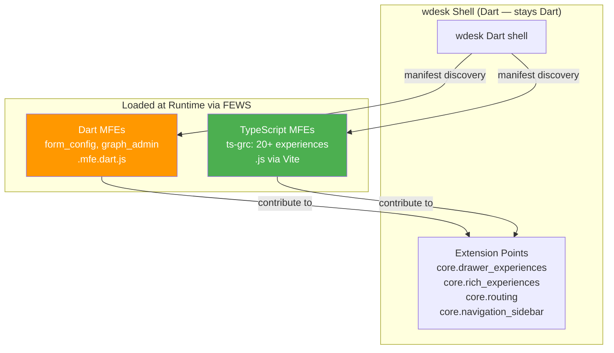
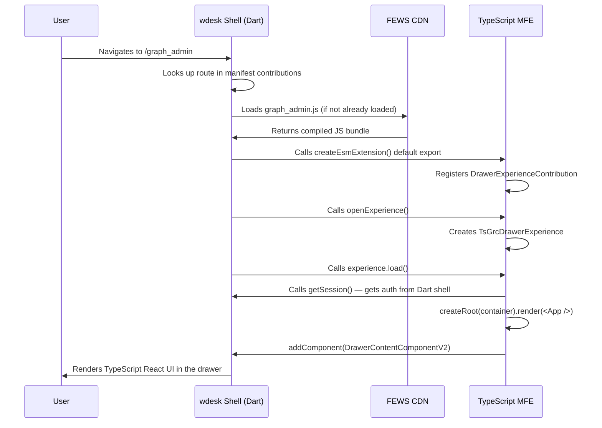
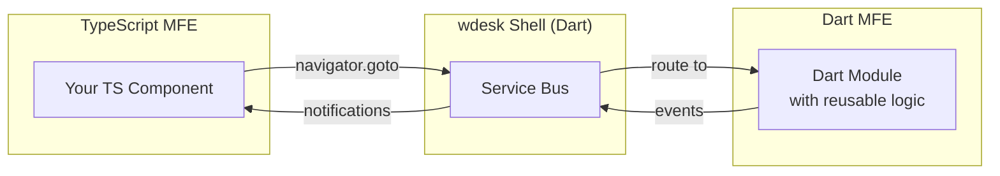
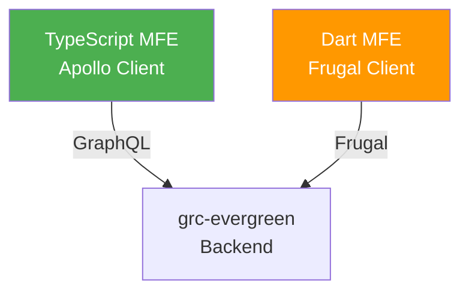
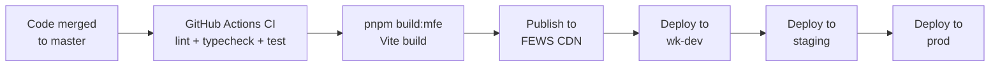

# How to Migrate a Dart Repo to TypeScript and Integrate with WDesk

> **Date:** 2026-08-20
> **Purpose:** Step-by-step guide for migrating a single Dart/OverReact GRC repository to TypeScript/React and integrating it with the Dart wdesk shell — without migrating wdesk itself.
> **Audience:** Engineers planning or executing the migration
> **Companion doc:** `dart-to-typescript-migration-poc-analysis_claude.md` (full analysis)

---

## Table of Contents

1. [Why wdesk Does NOT Need to Be Migrated](#1-why-wdesk-does-not-need-to-be-migrated)
2. [How a TypeScript MFE Integrates with the Dart wdesk Shell](#2-how-a-typescript-mfe-integrates-with-the-dart-wdesk-shell)
3. [Step-by-Step: Migrating One Repo to TypeScript](#3-step-by-step-migrating-one-repo-to-typescript)
4. [How to Use Dart Platform Services from TypeScript](#4-how-to-use-dart-platform-services-from-typescript)
5. [How to Reuse Dart Components and Modules from TypeScript](#5-how-to-reuse-dart-components-and-modules-from-typescript)
6. [Dart-to-TypeScript Pattern Translation Reference](#6-dart-to-typescript-pattern-translation-reference)
7. [Deployment, Rollout, and Rollback](#7-deployment-rollout-and-rollback)
8. [Removing the Dart Version from wdesk](#8-removing-the-dart-version-from-wdesk)

---

## 1. Why wdesk Does NOT Need to Be Migrated

wdesk is the **host shell** — it discovers and loads MFEs at runtime regardless of their language. A TypeScript MFE runs inside the Dart wdesk shell exactly the same way a Dart MFE does.

**This is already in production.** Today, the wdesk shell simultaneously loads:

- **Compile-time Dart modules** — `w_sox` (graph_app), `request_portal`, `framework_explorer` — bundled via `wdesk/pubspec.yaml`
- **Runtime Dart MFEs** — `form_config`, `graph_admin` — deployed to FEWS CDN
- **Runtime TypeScript MFEs** — `ts-grc` with 20+ experiences — deployed to FEWS CDN



**How it works:**

1. wdesk shell starts and reads its `web/manifest.yaml` which declares extension points (`core: {}`)
2. FEWS (Frontend Web Service) returns a list of all registered MFEs targeting `apps: [wdesk]`
3. For each MFE, wdesk loads its `manifest.yaml` and discovers its contributions (drawer experiences, routes, sidebar entries, panels)
4. When a user navigates to a route, wdesk dynamically loads the MFE's JavaScript entry point
5. The MFE renders its React (or OverReact) UI into the DOM container provided by the shell

**The shell doesn't care about the language.** It loads a JavaScript file and calls its ESM `default` export. Whether that JS was compiled from Dart (dart2js) or TypeScript (Vite) is irrelevant.

---

## 2. How a TypeScript MFE Integrates with the Dart wdesk Shell

### The Integration Contract

A TypeScript MFE integrates with wdesk through three artifacts:

| Artifact | Purpose | Example |
|---|---|---|
| **manifest.yaml** | Declares the MFE name, target apps, extensions, contributions (experiences, routes, sidebar entries) | `apps/ts-grc/manifest.yaml` |
| **entrypoint.ts** | ESM module that exports `createEsmExtension()` — the shell calls this to register the MFE | `apps/ts-grc/src/graph_admin.ts` |
| **experience class** | Implements the `DrawerExperience` lifecycle — `load()` mounts React into the DOM, `unload()` cleans up | `apps/ts-grc/src/experience/TsGrcDrawerExperience.tsx` |

### Manifest (manifest.yaml)

The manifest tells wdesk what the MFE provides. It is language-agnostic — same format for Dart and TypeScript.

```yaml
# Example: registering a TypeScript experience inside the Dart wdesk shell
version: 1

microfrontends:
  phoenix-graph-admin:                    # MFE identifier
    apps: [ wdesk ]                        # Target host app
    extensions:
      phoenix-graph-admin:                 # Extension name
        entrypoint: src/graph_admin.ts     # JS entry point (Vite resolves this)
        contributions:
          core.drawer_experiences:         # Contributes a drawer experience
            - name: graph-admin
              details:
                display_name:
                  default_text: Graph Admin
                can_user_access: "ability.182 || ability.183"  # Licensing gate
          core.routing:                    # Contributes a route
            - name: graph_admin_route
              details:
                route_segment: graph_admin
                experience_name: phoenix-graph-admin.core.drawer_experiences.graph-admin
          core.navigation_sidebar:         # Contributes a sidebar link
            - name: graph_admin_link
              details:
                icon: unify.settings
                text:
                  default_text: Graph Admin
                url: graph_admin
                location: default@4
```

### Entry Point (entrypoint.ts)

The entry point is an ESM module that creates the MFE extension and registers its experience contributions.

```typescript
// apps/ts-grc/src/graph_admin.ts
import {
  DrawerExperienceContributionHost,
  DrawerExperienceContribution,
  DrawerExperience,
} from '@workiva/drawer_experience_contribution';
import { createEsmExtension } from '@workiva/microfrontend';
import { TsGrcDrawerExperience } from './experience/TsGrcDrawerExperience';
import { graphAdminRouterSettings } from '@workiva/graph-admin-client';

class GraphAdminExperienceContribution extends DrawerExperienceContribution {
  readonly extensionName: string = 'phoenix-graph-admin';
  readonly simpleName: string = 'graph-admin';

  async openExperience(): Promise<DrawerExperience> {
    return new TsGrcDrawerExperience(graphAdminRouterSettings);
  }
}

export default createEsmExtension({
  contributions: [
    new DrawerExperienceContributionHost(new GraphAdminExperienceContribution()),
  ],
});
```

### Experience Class (TsGrcDrawerExperience.tsx)

The experience class bridges the wdesk shell lifecycle to React. It gets session/auth from the Dart shell and renders a React app.

```typescript
// apps/ts-grc/src/experience/TsGrcDrawerExperience.tsx
import { createRoot, type Root } from 'react-dom/client';
import { DrawerContentComponentV2, DrawerExperience } from '@workiva/drawer_experience_contribution';
import { getSession } from '@workiva/session_mfe_service';
import { Environment } from '@workiva/wdesk_browser_environment';

export class TsGrcDrawerExperience extends DrawerExperience {
  private routerSettings: RouterSettings;

  constructor(routerSettings: RouterSettings) {
    super();
    this.routerSettings = routerSettings;
  }

  async load(): Promise<void> {
    // 1. Get session from the Dart wdesk shell
    const {
      getAccessToken,
      getAccountResourceId,     // workspaceId
      getMembershipResourceId,  // membershipId
      getOrganizationId,        // organizationId
      getUserResourceId,        // userId
      getUsername,
    } = await getSession();

    const workspaceId = await getAccountResourceId();
    const userId = await getUserResourceId();
    let root: Root | null = null;

    // 2. Mount React into the DOM container provided by the shell
    super.addComponent(
      new DrawerContentComponentV2({
        content: {
          mount: (container: Element) => {
            root = createRoot(container, {
              identifierPrefix: 'ts-grc-drawer',  // Prevents useId collisions with other React instances
            });
            root.render(
              <MfeRouter
                getAccessToken={getAccessToken}
                getServiceUri={Environment.getServiceUri}
                workspaceId={workspaceId}
                userId={userId}
                routerSettings={this.routerSettings}
              />,
            );
          },
          unmount: () => {
            root?.unmount();
            root = null;
          },
        },
        includeContainerPadding: false,
      }),
    );

    return super.load();
  }
}
```

### How This Connects to the Dart Shell



---

## 3. Step-by-Step: Migrating One Repo to TypeScript

Using `graph_admin` as the concrete example (23 Dart files, 8 components).

### Step 1: Create the TypeScript Package in ts-grc

```bash
cd /path/to/ts-grc
pnpm create:experience
# Package name: graph-admin-client
# Description: Graph admin experience for internal support tools
```

This scaffolds:
```
packages/graph-admin-client/
├── package.json
├── tsconfig.json
├── src/
│   ├── index.ts           # Public API barrel
│   └── routerSettings.tsx # Route definitions
```

### Step 2: Replace Frugal API Calls with REST/GraphQL

**Dart (current):**
```dart
// Frugal RPC over HTTP — binary Thrift protocol
class GraphAdminClient extends BaseServiceClient<FAdminServiceClient> {
  GraphAdminClient(FrugalMessagingProvider frugalMessagingProvider)
    : super(
        frugalMessagingProvider: frugalMessagingProvider,
        clientFactory: fAdminServiceClientFactory,
        url: Environment.current.getServiceUri('graph-server') + '/admin',
      );

  Future<List<BigSkyAccount>?> getAccounts() => withServiceCall(
    (client, ctx) => client!.getAccounts(ctx),
  );
}
```

**TypeScript (replacement) — REST over HTTPS:**
```typescript
// packages/graph-admin-client/src/api/graphAdminApi.ts
import { getSession } from '@workiva/session_mfe_service';
import { Environment } from '@workiva/wdesk_browser_environment';

const getBaseUrl = () => Environment.getServiceUri('graph-server') + '/admin';

const authHeaders = async (): Promise<HeadersInit> => {
  const session = await getSession();
  const accessToken = await session.getAccessToken();
  const workspaceId = await session.getAccountResourceId();
  const orgId = await session.getOrganizationId();
  const userId = await session.getUserResourceId();
  return {
    Authorization: `Bearer ${accessToken}`,
    'Content-Type': 'application/json',
    'x-workiva-organization': orgId,
    'x-workiva-userrid': userId,
    'x-workiva-workspace': workspaceId,
  };
};

export type Account = {
  id: string;
  name: string;
  organizationId: string;
  partition?: string;
};

export async function getAccounts(): Promise<Account[]> {
  const res = await fetch(`${getBaseUrl()}/accounts`, {
    headers: await authHeaders(),
  });
  if (!res.ok) throw new Error(`getAccounts failed: ${res.status}`);
  return res.json();
}
```

**If the backend has GraphQL (preferred):**
```typescript
// Using Apollo Client — same pattern as all other ts-grc packages
import { useQuery, gql } from '@apollo/client';

const GET_ACCOUNTS = gql`
  query graphadmin_accountslist_getaccounts {
    getAccounts {
      id
      name
      organizationId
      partition
    }
  }
`;

export function useAccounts() {
  return useQuery(GET_ACCOUNTS);
}
```

### Step 3: Convert OverReact Components to React

**Dart (current):**
```dart
// mixin props + uiFunction pattern
mixin AccountsTableProps on UiProps {
  late AccountsStore store;
  late AccountsActions actions;
}

UiFactory<AccountsTableProps> AccountsTable = uiFunction(
  (props) {
    final pageIndex = useState(0);
    final filterText = useState<String?>("");
    final accounts = props.store.accounts;

    return (mui.TableContainer())(
      (mui.Table()..stickyHeader = true)(
        (mui.TableHead())(
          (mui.TableRow())(
            (mui.TableCell())('Name'),
            (mui.TableCell())('Organization'),
            (mui.TableCell())('Actions'),
          ),
        ),
        (mui.TableBody())(
          accounts.map((account) => (mui.TableRow()..key = account.id)(
            (mui.TableCell())(account.name),
            (mui.TableCell())(account.organizationId),
            (mui.TableCell())(
              (AccountActionsDropdown()..account = account)(),
            ),
          )).toList(),
        ),
      ),
    );
  },
  _$AccountsTableConfig,
);
```

**TypeScript (replacement):**
```tsx
// packages/graph-admin-client/src/components/AccountsTable.tsx
import { useState } from 'react';
import {
  Table, TableContainer, TableHead, TableBody, TableRow, TableCell,
  Paper, TextField, InputAdornment,
} from '@workiva/unify';
import { UnifyIcons } from '@workiva/unify/UnifyIcons';
import { AccountActionsDropdown } from './AccountActionsDropdown';
import type { Account } from '../api/graphAdminApi';

type AccountsTableProps = {
  accounts: Account[];
  onRevert: (accountId: string, revertDate: number) => void;
  onSyncMembers: (accountId: string) => void;
  onClearCache: (accountId: string) => void;
};

export function AccountsTable({ accounts, onRevert, onSyncMembers, onClearCache }: AccountsTableProps) {
  const [filter, setFilter] = useState('');

  const filtered = accounts.filter(
    (a) => a.name.toLowerCase().includes(filter.toLowerCase()),
  );

  return (
    <TableContainer component={Paper}>
      <TextField
        size="small"
        placeholder="Filter accounts"
        value={filter}
        onChange={(e) => setFilter(e.target.value)}
        InputProps={{
          startAdornment: <InputAdornment position="start"><UnifyIcons.Search /></InputAdornment>,
        }}
      />
      <Table stickyHeader={true}>
        <TableHead>
          <TableRow>
            <TableCell>Name</TableCell>
            <TableCell>Organization</TableCell>
            <TableCell>Actions</TableCell>
          </TableRow>
        </TableHead>
        <TableBody>
          {filtered.map((account) => (
            <TableRow key={account.id}>
              <TableCell>{account.name}</TableCell>
              <TableCell>{account.organizationId}</TableCell>
              <TableCell>
                <AccountActionsDropdown
                  account={account}
                  onRevert={onRevert}
                  onSyncMembers={onSyncMembers}
                  onClearCache={onClearCache}
                />
              </TableCell>
            </TableRow>
          ))}
        </TableBody>
      </Table>
    </TableContainer>
  );
}
```

### Step 4: Replace State Management

**Dart (w_flux store):**
```dart
class AccountsStore extends Store {
  List<BigSkyAccount> _accounts = [];
  List<BigSkyAccount> get accounts => _accounts;

  AccountsStore(AccountsActions actions, ...) {
    triggerOnActionV2(actions.searchAccounts, _searchAccounts);
    triggerOnActionV2(actions.revertAccount, _revertAccount);
  }

  Future<void> _searchAccounts(String query) async {
    _accounts = await _graphAdminClient.getAccounts();
    // Store automatically triggers re-render
  }
}
```

**TypeScript (React hooks — for small modules):**
```tsx
// packages/graph-admin-client/src/hooks/useAccountsState.ts
import { useState, useEffect } from 'react';
import { getAccounts, type Account } from '../api/graphAdminApi';

export function useAccountsState() {
  const [accounts, setAccounts] = useState<Account[]>([]);
  const [loading, setLoading] = useState(true);
  const [error, setError] = useState<string | null>(null);

  useEffect(() => {
    getAccounts()
      .then(setAccounts)
      .catch((e) => setError(e.message))
      .finally(() => setLoading(false));
  }, []);

  return { accounts, loading, error, refetch: () => getAccounts().then(setAccounts) };
}
```

### Step 5: Register the MFE Entry Point

```typescript
// apps/ts-grc/src/graph_admin.ts
import {
  DrawerExperienceContributionHost,
  DrawerExperienceContribution,
  DrawerExperience,
} from '@workiva/drawer_experience_contribution';
import { createEsmExtension } from '@workiva/microfrontend';
import { graphAdminRouterSettings } from '@workiva/graph-admin-client';
import { TsGrcDrawerExperience } from './experience/TsGrcDrawerExperience';

class GraphAdminContribution extends DrawerExperienceContribution {
  readonly extensionName = 'phoenix-graph-admin';
  readonly simpleName = 'graph-admin';
  async openExperience(): Promise<DrawerExperience> {
    return new TsGrcDrawerExperience(graphAdminRouterSettings);
  }
}

export default createEsmExtension({
  contributions: [new DrawerExperienceContributionHost(new GraphAdminContribution())],
});
```

### Step 6: Add Routes

```tsx
// packages/graph-admin-client/src/routerSettings.tsx
import type { RouterSettings } from '@workiva/router';
import { GraphAdminPage } from './pages/GraphAdminPage';

export const graphAdminRouterSettings: RouterSettings = {
  routes: [
    { index: true, element: <GraphAdminPage /> },
  ],
};
```

### Step 7: Add to manifest.yaml

Add the MFE extension to `apps/ts-grc/manifest.yaml` (see the manifest example in Section 2).

### Step 8: Build, Test, Deploy

```bash
# Build
pnpm build:mfe

# Test
cd packages/graph-admin-client && pnpm test

# Type check
pnpm typecheck:package graph-admin-client

# Lint & format
pnpm eslint --fix packages/graph-admin-client
pnpm prettier --write packages/graph-admin-client

# Deploy to wk-dev
# CI pipeline handles: build → deploy to FEWS → wdesk discovers the new MFE
```

---

## 4. How to Use Dart Platform Services from TypeScript

The wdesk Dart shell provides platform services that TypeScript MFEs consume through **JavaScript bridge packages**. These packages have both Dart and TypeScript bindings — the shell registers the Dart implementation, and the TypeScript MFE calls the JavaScript API.

### Available Platform Services

| Dart Service | TypeScript Package | What It Provides | How to Use |
|---|---|---|---|
| `w_session` (Session) | `@workiva/session_mfe_service` ^1.54.174 | Auth tokens, workspace ID, user ID, org ID, username | `const session = await getSession()` |
| `wdesk_sdk` (Navigator) | `@workiva/navigator_mfe_service` ^1.4.323 | Cross-experience navigation | `const nav = await getNavigator(); nav.goto('experience-name')` |
| `wdesk_browser_environment` | `@workiva/wdesk_browser_environment` ^1.17.60 | Service URIs, environment detection | `Environment.getServiceUri('grc-evergreen')` |
| `wdesk_sdk` (Shell) | `@workiva/drawer_experience_contribution` ^1.1.14 | Drawer/rich experience lifecycle, DOM mount/unmount | `super.addComponent(new DrawerContentComponentV2(...))` |
| `wdesk_sdk` (Panels) | `@workiva/panel_contribution_point` ^1.3.46 | Side panel contributions (e.g., process narrative panel) | Manifest `panel.panels` contribution |
| `microfrontend` (MFE SDK) | `@workiva/microfrontend` ^2.14.1 | MFE extension registration | `createEsmExtension({ contributions: [...] })` |
| Task Portal | `@workiva/task_portal_contribution_point` ^4.54.174 | Task portal task type registration | Manifest `task_portal.solution_specific_tasks` contribution |
| Vite MFE Build | `@workiva/vite-plugin-microfrontend` ^2.13.21 | Vite build plugin for MFE asset generation | `vite.config.ts` plugin |

### Example: Getting Auth from the Dart Shell

```typescript
import { getSession } from '@workiva/session_mfe_service';

// This calls into the Dart wdesk shell's session service
// The shell registered the Dart implementation at boot time
// The TS package calls the JS bridge — completely transparent
const session = await getSession();
const accessToken = await session.getAccessToken();
const workspaceId = await session.getAccountResourceId();
const orgId = await session.getOrganizationId();
const userId = await session.getUserResourceId();
const username = await session.getUsername();
```

### Example: Navigating to a Dart Experience from TypeScript

```typescript
import { getNavigator } from '@workiva/navigator_mfe_service';

// Navigate to a Dart experience (e.g., graph_app's "focus" experience)
const navigator = await getNavigator();
await navigator.goto('focus', {
  resourceId: vertexId,
  tail: 'controls',
});

// This works regardless of whether the target experience is Dart or TypeScript
// The wdesk shell handles the routing
```

### Example: Getting Service URIs

```typescript
import { Environment } from '@workiva/wdesk_browser_environment';

// Same API as the Dart version — returns the service URL for the current environment
const grcEvergreen = Environment.getServiceUri('grc-evergreen');
const graphServer = Environment.getServiceUri('graph-server');
const identityService = Environment.getServiceUri('identity');
```

---

## 5. How to Reuse Dart Components and Modules from TypeScript

### The Short Answer

**You cannot directly import Dart components into TypeScript.** OverReact components compile to dart2js JavaScript that is not importable as ES modules. There is no interop bridge for rendering a Dart OverReact component inside a React tree.

### What You CAN Do

#### Option A: Use the TypeScript Equivalent (Recommended)

Most Dart platform components already have TypeScript equivalents:

| Dart Component/Module | TypeScript Equivalent | Package |
|---|---|---|
| `unify_ui` (Dart MUI wrapper) | `@workiva/unify` (native React MUI) | `@workiva/unify` ^2.32.1 |
| `web_skin_dart` Button, Modal, etc. | `@workiva/unify` Button, Dialog, etc. | `@workiva/unify` ^2.32.1 |
| `w_comments` (comments module) | `@workiva/comments-library` | `@workiva/comments-library` ^0.1.401 |
| `w_attachments` (evidence) | `@workiva/grc-evidence-components` | Workspace package |
| `graph_ui` DataPanel/HistoryPanel | `@workiva/ts-grc-history-panel-ui` | Workspace package |
| `graph_ui` FolderListExperience | `@workiva/ts-grc-data-grid-next` (MUI DataGridPro) | Workspace package |
| `graph_ui` FormService | `@workiva/grc-state` (GraphQL + RTK Query) | Workspace package |
| `graph_ui` export | `@workiva/ts-grc-grid-export-ui` | Workspace package |
| `content_extension_framework` | `@workiva/content_entity` | `@workiva/content_entity` ^3.0.16 |
| DPC integration | `@workiva/mfe_dpc_api` | `@workiva/mfe_dpc_api` ^6.1.1 |

#### Option B: Consume Dart Functionality via MFE Service Boundary

If a Dart module provides functionality that has no TS equivalent, you can consume it through the **MFE service boundary** — the wdesk shell mediates communication between MFEs.



**How this works in practice:**

1. **Cross-experience navigation** — Your TypeScript MFE navigates to a Dart experience:
   ```typescript
   const navigator = await getNavigator();
   await navigator.goto('compliance_manager', { resourceId: frameworkId });
   ```

2. **Shared platform services** — Both Dart and TS MFEs consume the same platform services (session, notifications, modals):
   ```typescript
   // TypeScript side — shows notification visible to all MFEs
   import { notify } from '@workiva/notifications';
   notify('Account reverted successfully', { severity: 'success' });
   ```

3. **Task portal integration** — A TypeScript MFE can register task types that interact with Dart task handlers:
   ```yaml
   # manifest.yaml — TS MFE registers a task type
   task_portal.solution_specific_tasks:
     - name: phoenix_request_activity
       details:
         task_configs:
           - type: "grc.request.activity"
   ```

#### Option C: Backend-Mediated Data Sharing

If both Dart and TypeScript need the same data, they should both call the same backend API independently rather than passing data between MFEs:



Both get the same data. No cross-MFE data sharing needed.

#### Option D: Embed via Panel Contribution (for Side Panels)

If a Dart module provides a side panel (like HistoryPanel or DataPanel), the TypeScript MFE can contribute a panel via the manifest and the shell will render it alongside the Dart panel:

```yaml
# TypeScript MFE contributes a panel
panel.panels:
  - name: process-narrative-panel
    details:
      when: abilities["-194"]
      icon: unify.verifiedUser
      location: default@2
      label: Controls
      panel_region: secondary
      experiences: [ doc_plat_client_extension.core.rich_experiences.text_document ]
```

ts-grc already does this — the `grc-process-narrative-panel` extension contributes a panel that appears alongside Dart experiences.

### What You Should NOT Do

| Anti-pattern | Why |
|---|---|
| Load dart2js output as a module in TypeScript | dart2js output is a self-contained IIFE, not an ES module. No exports. |
| Share React instances between Dart OverReact and TypeScript React | Each has its own React runtime. Sharing causes hooks state corruption. |
| Use `window` as a global data bus between MFEs | Fragile, untyped, no lifecycle management. Use MFE services instead. |
| Wrap a Dart component in a web component for TS consumption | Technically possible but adds complexity, doubles bundle size, and creates maintenance burden. Rebuild in React instead. |

---

## 6. Dart-to-TypeScript Pattern Translation Reference

| Dart Pattern | TypeScript Equivalent | Package |
|---|---|---|
| `mixin FooProps on UiProps` | `type FooProps = { ... }` | — |
| `UiFactory<P> Foo = uiFunction((props) => ..., config)` | `export function Foo(props: FooProps) { ... }` | `react` |
| `(mui.Button()..onClick = handler)('Label')` | `<Button onClick={handler}>Label</Button>` | `@workiva/unify` |
| `useSelector<S, T>((s) => s.field)` | `useSelector((s: RootState) => s.field)` | `react-redux` |
| `useDispatch()` | `useDispatch()` | `react-redux` |
| `useState(initialValue)` | `useState(initialValue)` | `react` |
| `Store<S>(reducer, initialState: s, middleware: [...])` | `configureStore({ reducer, middleware: [...] })` | `@reduxjs/toolkit` |
| `triggerOnActionV2(action, handler)` | `createAsyncThunk('name', handler)` | `@reduxjs/toolkit` |
| `FluxUiComponent2<P>` with `redrawOn()` | `useSelector()` hooks in functional component | `react-redux` |
| `Intl.message('text', name: 'key')` | `intl.formatMessage({ defaultMessage: 'text', description: '...' })` | `react-intl` |
| `Intl.plural(n, one: '...', other: '...')` | `<FormattedMessage defaultMessage="{n, plural, one {# item} other {# items}}" />` | `react-intl` |
| `flagManager.variationOr('flag', false)` | `useAppFlags().flagName` | `@workiva/grc-launch-darkly` |
| `licensingApi.canUserV4(abilityId: 182)` | `fetch(identityUri/abilities/ids)` then check array | `fetch` API |
| `frugalMessagingProvider.newHttpRpcClient(...)` | `fetch()` or Apollo Client `useQuery()` | `@apollo/client` |
| `Environment.current.getServiceUri('svc')` | `Environment.getServiceUri('svc')` | `@workiva/wdesk_browser_environment` |
| `appContext.navigator.goToExperience('exp', resourceId: id)` | `navigator.goto('exp', { resourceId: id })` | `@workiva/navigator_mfe_service` |
| `WdeskExtension.onRegisterContributions()` | `createEsmExtension({ contributions: [...] })` | `@workiva/microfrontend` |
| `DrawerExperience.onLoad()` / `loadChildModule()` | `DrawerExperience.load()` with `createRoot().render()` | `@workiva/drawer_experience_contribution` |
| `part 'file.over_react.g.dart'` | Not needed — no code generation for components | — |
| `part 'model.sg.g.dart'` (built_value) | Not needed — TypeScript `type`/`interface` | — |
| `Disposable` / `manageDisposable()` | `useEffect(() => { return () => cleanup() }, [])` | `react` |

---

## 7. Deployment, Rollout, and Rollback

### Build and Deploy Pipeline



### Feature-Flagged Rollout

The TypeScript MFE can coexist with the Dart version during transition:

1. **Deploy the TS MFE** — It registers its experience contributions via manifest
2. **Gate with feature flag** — Use `can_user_access: "feature_flag.grc-phoenix-graph-admin"` in the manifest
3. **Enable per environment** — Turn on the flag in wk-dev first, then staging, then prod
4. **Both versions coexist** — The Dart version is still bundled in wdesk; the TS version is loaded from FEWS. The feature flag controls which one the user sees.

### Rollback

| Scenario | Action |
|---|---|
| TS MFE has a bug in wk-dev | Disable the feature flag — Dart version takes over |
| TS MFE has a bug in staging | Disable the feature flag OR re-deploy previous FEWS build |
| TS MFE has a bug in prod (before Dart removal) | Disable the feature flag immediately |
| TS MFE has a bug in prod (after Dart removal) | Re-deploy previous FEWS BUILD_ID OR rollback wdesk to version with Dart package |

---

## 8. Removing the Dart Version from wdesk

After the TypeScript MFE is stable in ALL environments, remove the Dart version:

### Step 1: Remove from wdesk/pubspec.yaml

```yaml
# REMOVE these lines:
  w_sox:          # Contains universe, assessments, framework, requests
  request_portal:
  framework_explorer:
```

### Step 2: Remove from experience_registry.dart

```dart
// REMOVE these imports:
import 'package:framework_explorer/framework_explorer.dart';
import 'package:request_portal/experiences.dart';
import 'package:w_sox/experience_configs.dart' as w_sox;
import 'package:w_sox/landing_page_widgets.dart' as ir_widgets;

// REMOVE all w_sox.*, FrameworkExplorer*, RequestPortal* experience registrations
// from drawerExperiences, richExperiences, embeddableExperiences, landingPageWidgets
```

### Step 3: Coordinate wdesk Release

| Action | Owner | Timing |
|---|---|---|
| Verify TS MFE stable in ALL environments (wk-dev → staging → prod) | GRC team | Before wdesk release |
| Create wdesk PR removing Dart packages | GRC team + wdesk team | After stability verification |
| Deploy wdesk release with Dart packages removed | wdesk team | Coordinated release window |
| Monitor for regressions (1 week) | GRC team | Post-release |
| Remove feature flag (no longer needed) | GRC team | After monitoring period |

### Step 4: Celebrate

The wdesk bundle shrinks. The Dart repo can be archived. The TypeScript MFE deploys independently on its own cadence.

---

## Summary: The Golden Path

```
1. Create TS package in ts-grc monorepo
2. Replace Frugal calls with GraphQL/REST
3. Convert OverReact components to React/TypeScript
4. Replace w_flux stores with React hooks or RTK
5. Register MFE entry point + manifest contributions
6. Deploy to FEWS behind feature flag
7. Validate in wk-dev → staging → prod
8. Remove Dart package from wdesk pubspec
9. Archive the Dart repo
```

**wdesk stays Dart. Your module becomes TypeScript. They coexist through the MFE architecture. This is already working in production with 20+ ts-grc experiences.**
